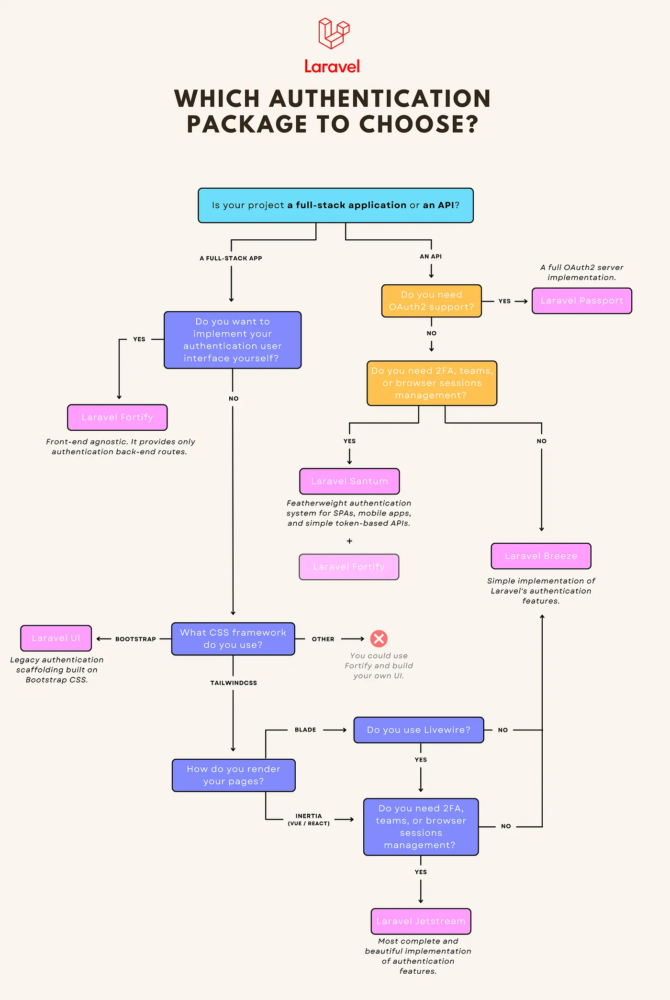
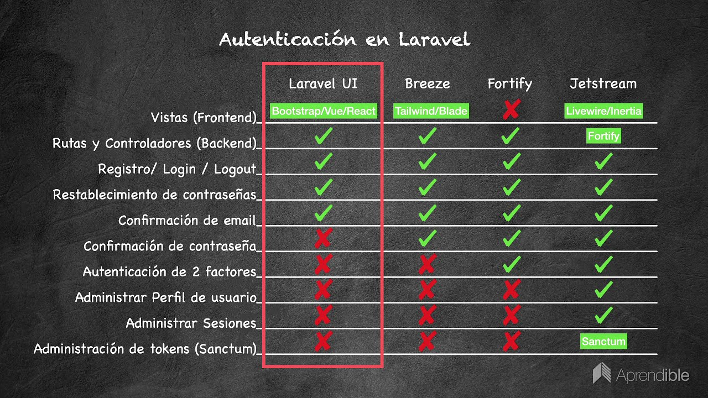

References

- [Which Laravel authentication package to choose?](https://medium.com/@antoine.lame/which-laravel-authentication-package-to-choose-290551a82a44)
  
- [Laravel Authentication Packages: A Comparative Analysis](https://aglowiditsolutions.com/blog/laravel-authentication/)
  

---

### [Laravel UI](https://github.com/laravel/ui)

- legacy, uses Bootstrap CSS framework
- Bootstrap, React, or Vue
- composer require laravel/ui
- php artisan ui vue --auth
- npm install
- npm run dev

---

### [Laravel Breeze](https://github.com/laravel/breeze)

- Starter Kits uses Breeze
- Minimalist, lightweight authentication scaffolding
- Includes login, registration, password reset, email verification, and password confirmation
- Includes a simple "profile" page where the user may update their name, email address, and password
- Blade templates styled with Tailwind CSS
- Provides scaffolding options based on Livewire or Inertia (Vue or React)
- _API only_ option scaffold an authentication API that is ready to authenticate modern JavaScript applications such as those powered by Next or Nuxt
- [Next reference implementation](https://github.com/laravel/breeze-next)
- Includes [Laravel Sanctum](https://github.com/laravel/sanctum) (but it is not used) and [Ziggy](https://github.com/tighten/ziggy)
- Login is based on Session
- Uses uppercase in resources/js directories
- composer require laravel/breeze --dev
- php artisan breeze:install
  - Which Breeze stack would you like to install?
    - [ ] Blade with Alpine
    - [ ] Livewire (Volt Class API) with Alpine
    - [ ] Livewire (Volt Functional API) with Alpine
    - [x] React with Inertia
    - [ ] Vue with Inertia
    - [ ] API only
  - Would you like any optional features?
    - [x] Dark mode
    - [ ] Inertia SSR
    - [x] TypeScript
    - [x] ESLint with Prettier
  - Which testing framework do you prefer?
    - [x] Pest
    - [ ] PHPUnit
- php artisan migrate
- npm install --legacy-peer-deps
- npm run dev
- Files created/updated
  - app/Http/Controllers/Auth/
  - app/Http/Controllers/ProfileController.php
  - app/Http/Middleware/HandleInertiaRequests.php
  - app/Http/Requests/Auth/LoginRequest.php
  - app/Providers/AppServiceProvider.php // _Vite::prefetch(concurrency: 3)_
  - bootstrap/app.php
    - withMiddleware -> web
    - \App\Http\Middleware\HandleInertiaRequests::class
    - \Illuminate\Http\Middleware\AddLinkHeadersForPreloadedAssets::class
  - resources/css/app.css // _@tailwind_
  - resources/js/app.ts
  - resources/js/bootstrap.ts
  - resources/js/Components/ // _General Vue Components_
  - resources/js/Layouts/
  - resources/js/Pages/
  - resources/js/types/
  - resources/views/app.blade.php
    - @routes // _Ziggy_
    - @vite(['resources/js/app.ts', "resources/js/Pages/{$page['component']}.vue"])
    - @inertiaHead
    - @inertia
  - routes/auth.php
  - routes/web.php
  - tests/Feature/Auth/
  - tests/Feature/ProfileTest.php
  - tests/Pest.php
  - .eslintrc.cjs, .prettierrc, postcss.config.js, tailwind.config.js, tsconfig.json, vite.config.js

---

### [Laravel Starter Kits](https://laravel.com/starter-kits)

- Evolution of Laravel Breeze
- laravel new project --vue --pest --git // _composer create-project laravel/laravel project_
  - Which starter kit would you like to install?
    - [ ] None
    - [ ] React
    - [x] Vue
    - [ ] Livewire
  - Which authentication provider do you prefer?
    - [x] Laravel's built-in authentication
    - [ ] WorkOS
  - Which testing framework do you prefer?
    - [x] Pest
    - [ ] PHPUni
  - Starter Kits
    - React 19, TypeScript, Inertia 2, [shadcn/ui](https://ui.shadcn.com/)
    - Vue 3, TypeScript, Inertia 2, [shadcn-vue](https://www.shadcn-vue.com/)
    - Livewire 3, [Laravel Volt](https://livewire.laravel.com/docs/volt), [Flux UI](https://fluxui.dev/)
- Includes
  - Built-in Laravel authentication (based on Session)
    - Login, registration, password reset, and email verification
  - [WorkOS](https://workos.com/) [AuthKit](https://www.authkit.com/) authentication
    - Login with GitHub, Google, Microsoft, or Apple ID, Passkey support, code sent via email, built-in rate limiting, geographical protection, and SSO
  - Customer dashboard
  - User settings: user profile, password
  - Appearance management: Light and dark
  - Configurable layouts
    - Authentication layouts: simple, card, or split
    - Application layouts: sidebar, or header
    - Sidebar layouts: default, inset, floating
  - Tailwind CSS V4
  - TypeScript supported
  - Built-in CI workflows
    - GitHub Actions workflows for automated testing and code linting
  - Publish additional shadcn components
    - npx shadcn@latest add switch // _React_
    - npx shadcn-vue@latest add switch // _Vue_
  - hooks (React) and composables (Vue)
  - Inertia SSR
    - npm run build:ssr
    - composer dev:ssr
  - email verification
    - App/Models/User -> implements MustVerifyEmail
    - verified middleware to the routes
    - php artisan vendor:publish --tag=laravel-mail
- Uses lowercase in resources/js directories
- Uses [laravel/wayfinder](https://github.com/laravel/wayfinder)
  - Bridge Laravel backend and TypeScript frontend
  - Generates fully-typed, importable TypeScript functions for your controllers and routes
  - Routes are generated during Vite's build step and whenever files change while running the Vite's dev server
  - php artisan wayfinder:generate --with-form // _Generate TypeScript definitions for your routes _and controller methods
  - Generates files in three directories (wayfinder, actions, and routes) within resources/js
  - import { show } from "@/actions/App/Http/Controllers/PostController";
  - show(1); // _{ url: "/posts/1", method: "get" }_
  - Using [Inertia](https://inertiajs.com/forms#wayfinder), pass the result of a Wayfinder method to the submit method of useForm
    - form.submit(store())
    - \<Form :action="store()">
- Files created/updated
  - app/Http/Controllers/Auth/
  - app/Http/Controllers/Settings/
  - app/Http/Middleware/HandleAppearance.php
  - app/Http/Middleware/HandleInertiaRequests.php
  - app/Http/Requests/Auth/
  - app/Http/Requests/Settings/
  - bootstrap/app.php
    - $middleware->encryptCookies(except: ['appearance', 'sidebar_state']);
    - withMiddleware -> web
    - \App\Http\Middleware\HandleAppearance::class
    - \App\Http\Middleware\HandleInertiaRequests::class
    - \Illuminate\Http\Middleware\AddLinkHeadersForPreloadedAssets::class
  - config/inertia.php
  - resources/css/app.css // _@tailwind_
  - resources/js/app.ts
  - resources/js/ssr.ts
  - resources/js/actions/ // _wayfinder_
  - resources/js/components/ // _General Vue Components_
  - resources/js/components/ui // _shadcn components_
  - resources/js/composables/ // _useAppearance.ts_
  - resources/js/layouts/ // _app, auth, settings_
  - resources/js/lib/ // _utils.ts_
  - resources/js/pages/
  - resources/js/routes/ // _wayfinder_
  - resources/js/types/
  - resources/js/wayfinder/ // _wayfinder_
  - resources/views/app.blade.php
    - Inline script to detect system dark mode
    - @vite(['resources/js/app.ts', "resources/js/pages/{$page['component']}.vue"])
    - @inertiaHead
    - @inertia
  - routes/auth.php
  - routes/settings.php
  - routes/web.php // _require auth and settings_
  - tests/Feature/Auth/
  - tests/Feature/Settings/
  - tests/Feature/DashboardTest.php
  - tests/Pest.php
  - components.json // _shadcn components_
  - .eslint.config.js, .prettierrc, tsconfig.json, vite.config.ts

---

### [Laravel Fortify](https://github.com/laravel/fortify)

- Headless authentication Backend-only, handles the core authentication logic (login, registration, password reset, etc.)
- composer require laravel/fortify
- php artisan fortify:install
- php artisan vendor:publish --tag=fortify-config
- php artisan migrate

---

### [Laravel Jetstream](https://jetstream.laravel.com)

- Feature-rich, Livewire/Inertia + Teams, API support via Fortify/Sanctum
- composer require laravel/jetstream
- php artisan jetstream:install inertia --teams --dark
- npm install --legacy-peer-deps
- npm run build
- php artisan migrate
- npm run dev
- php artisan vendor:publish --tag=jetstream-views

---

### [Laravel Sanctum](https://github.com/laravel/sanctum)

- API token authentication, issue personal access tokens for API access or manage authentication for SPAs and mobile applications.
- php artisan install:api // _composer require laravel/sanctum_
- php artisan vendor:publish --tag="sanctum-migrations"
- php artisan migrate

---

### [Laravel Passport](https://github.com/laravel/passport)

- OAuth2 server and API authentication package
- built on top of the League [OAuth2 server](https://github.com/thephpleague/oauth2-server)
- php artisan install:api --passport
- php artisan passport:keys
- php artisan vendor:publish --tag=passport-config

---

### [Laravel Socialite](https://github.com/laravel/socialite)

- OAuth authentication with Bitbucket, Facebook, GitHub, GitLab, Google, LinkedIn, Slack, Twitch, and X
- composer require laravel/socialite
