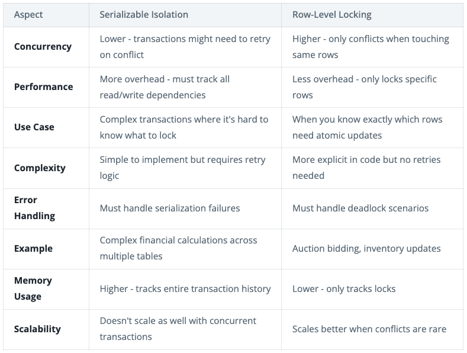
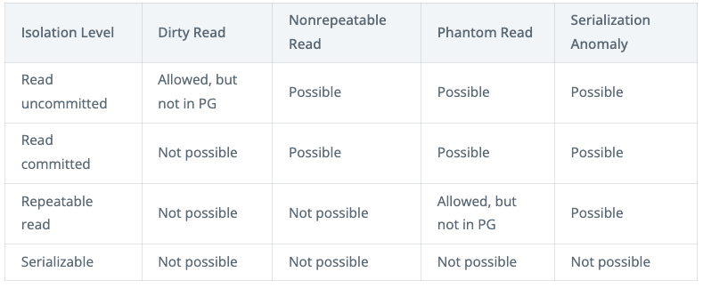

MVCC (Control de Concurrencia Multi-Versión - Multi-Version Concurrency Control)
WAL (Registro de Escritura Anticipada - Write-Ahead Logging)

## 1. Read Performance

### Full-Text Search: GIN (Generalized Inverted Index) index

```sql
-- Add a tsvector column for search
ALTER TABLE posts ADD COLUMN search_vector tsvector;
CREATE INDEX idx_posts_search ON posts USING GIN(search_vector);

-- Now you can do full-text search
SELECT * FROM posts
WHERE search_vector @@ to_tsquery('postgresql & database');
```

### JSONB column

```sql
-- Add a JSONB column for post metadata
ALTER TABLE posts ADD COLUMN metadata JSONB;
CREATE INDEX idx_posts_metadata ON posts USING GIN(metadata);

-- Now we can efficiently query posts with specific metadata
SELECT * FROM posts
WHERE metadata @> '{"type": "video"}'
  AND metadata @> '{"hashtags": ["coding"]}';

-- Or find all posts that mention a specific user
SELECT * FROM posts
WHERE metadata @> '{"mentions": ["user123"]}';
```

### Geospatial Search with PostGIS

```sql
-- Enable PostGIS
CREATE EXTENSION postgis;

-- Add a location column to posts
ALTER TABLE posts
ADD COLUMN location geometry(Point);

-- Create a spatial index
CREATE INDEX idx_posts_location
ON posts USING GIST(location);

-- Find all posts within 5km of a user
SELECT * FROM posts
WHERE ST_DWithin(
    location::geography,
    ST_MakePoint(-122.4194, 37.7749)::geography, -- SF coordinates
    5000  -- 5km in meters
);
```

### Covering indexes

```sql
-- Let's say this is a common query in our social media app:
SELECT title, created_at
FROM posts
WHERE user_id = 123
ORDER BY created_at DESC;

-- A covering index that includes all needed columns
CREATE INDEX idx_posts_user_include
ON posts(user_id) INCLUDE (title, created_at);
```

### Partial Indexes

```sql
-- Standard index indexes everything
CREATE INDEX idx_users_email ON users(email);  -- Indexes ALL users

-- Partial index only indexes active users
CREATE INDEX idx_active_users
ON users(email) WHERE status = 'active';  -- Smaller, faster index
```

## 2. Write Performance

When a write occurs in PostgreSQL:
1. **Transaction Log (WAL) Write [Disk]**: Changes are first written to the Write-Ahead Log (WAL) on disk. This is a sequential write operation, making it relatively fast. The WAL is critical for durability - once changes are written here, the transaction is considered durable because even if the server crashes, PostgreSQL can recover the changes from the WAL.
2. **Buffer Cache Update [Memory]**: Changes are made to the data pages in PostgreSQL's shared buffer cache, where the actual tables and indexes live in memory. When pages are modified, they're marked as "dirty" to indicate they need to be written to disk eventually.
3. **Background Writer [Memory → Disk]**: Dirty pages in memory are periodically written to the actual data files on disk. This happens asynchronously through the background writer, when memory pressure gets too high, or when a checkpoint occurs. This delayed write strategy allows PostgreSQL to batch multiple changes together for better performance.
4. **Index Updates [Memory & Disk]**: Each index needs to be updated to reflect the changes. Like table data, index changes also go through the WAL for durability. This is why having many indexes can significantly slow down writes - each index requires additional WAL entries and memory updates.

### Transaction isolation level**

**Read Committed (Default):**
  - This is the default isolation level in PostgreSQL.
  - Each statement within a transaction sees only data that was committed before that statement began.
  - It prevents dirty reads but allows "non-repeatable reads" (a row read twice within the same transaction might have different values if another transaction committed changes between the reads) and "phantom reads" (a query might return a different set of rows if another transaction committed insertions or deletions between two executions of the same query).

**Repeatable Read:**
  - A transaction at this level sees a snapshot of the database as it was when the transaction began.
  - It prevents dirty reads and non-repeatable reads, ensuring that if you read the same row multiple times within a transaction, you will always get the same value.
  - However, it still allows "phantom reads," meaning a query might return a different set of rows if another transaction committed insertions or deletions that fall outside the current transaction's initial snapshot.

**Serializable:**
  - This is the strongest isolation level, providing the highest level of consistency.
  - It guarantees that concurrent transactions produce the same result as if they were executed serially (one after another).
  - It prevents dirty reads, non-repeatable reads, and phantom reads.
  - PostgreSQL implements SERIALIZABLE using a technique called Serializable Snapshot Isolation (SSI), which detects and prevents "serialization anomalies" (situations where the outcome of concurrent transactions differs from any possible serial execution).
  - Transactions that cause serialization anomalies are rolled back and require retrying.

### Vertical Scaling

Consider just upgrading the hardware. This could mean using faster NVMe disks for better WAL performance, adding more RAM to increase the buffer cache size, or upgrading to CPUs with more cores to handle parallel operations more effectively.

### Batch Processing

The simplest optimization is to batch writes together. Instead of processing each write individually, we collect multiple operations and execute them in a single transaction.

### Write Offloading

Some writes don't need to happen synchronously. This pattern works especially well for handling activity logging, analytics events, metrics aggregation, and non-critical updates like "last seen" timestamps. These types of writes don't need to happen immediately and can be processed in the background without impacting the core user experience.

### Table Partitioning

For large tables, partitioning can improve both read and write performance by splitting data across multiple physical tables. The most common use case is time-based partitioning.

```sql
CREATE TABLE posts (
    id SERIAL,
    user_id INT,
    content TEXT,
    created_at TIMESTAMP
) PARTITION BY RANGE (created_at);

-- Create partitions by month
CREATE TABLE posts_2024_01 PARTITION OF posts
    FOR VALUES FROM ('2024-01-01') TO ('2024-02-01');
```

Why does this help writes? First, different database sessions can write to different partitions simultaneously, increasing concurrency. Second, when data is inserted, index updates only need to happen on the relevant partition rather than the entire table. Finally, bulk loading operations can be performed partition by partition, making it easier to load large amounts of data efficiently.

### Sharding

When a single node isn't enough, sharding lets you distribute writes across multiple PostgreSQL instances. You'll just want to be clear about what you're sharding on and how you're distributing the data. This is important, because when we go to read the data we want to avoid cross-shard queries where we need to scatter-gather data from multiple shards. You typically want to shard on the column that you're querying by most often.

Sharding adds complexity - you'll need to handle cross-shard queries, maintain consistent schemas across shards, and manage multiple databases. Only introduce it when simpler optimizations aren't sufficient.

You can use managed services like [Citus](https://www.citusdata.com/) which handles many of the sharding complexities for you.

## Replication

Most real-world deployments use replication for two key purposes:
  - Scaling reads by distributing queries across replicas
  - Providing high availability in case of node failures

Replication is the process of copying data from one database to one or more other databases. This is a key part of PostgreSQL's scalability and availability story.

PostgreSQL supports two main types of replication:
  - In synchronous replication, the primary waits for acknowledgment from replicas before confirming the write to the client. This provides stronger consistency but higher latency.
  - With asynchronous replication, the primary confirms the write to the client immediately and replicates changes to replicas in the background. This offers better performance but potential inconsistency between replicas.

### Scaling reads

The most common use for replication is to scale read performance. By creating read replicas, you can distribute read queries across multiple database instances while sending all writes to the primary.

There's one key caveat with read replicas: replication lag. If a user makes a change and immediately tries to read it back, they might not see their change if they hit a replica that hasn't caught up yet. This is known as "read-your-writes" consistency.

### High Availability

The second major benefit of replication is high availability. By maintaining copies of your data across multiple nodes, you can handle hardware failures without downtime. If your primary node fails, one of the replicas can be promoted to become the new primary.

## Data Consistency

If you've chosen to prioritize consistency over availability in your non-functional requirements, then PostgreSQL is a strong choice. It's built from the ground up to provide strong consistency guarantees through ACID transactions.

### Transactions

A transaction is a set of operations that are executed together and must either all succeed or all fail together. This is the foundation for ensuring consistency in PostgreSQL. The transaction ensures atomicity - either both updates happen or neither does. However, transactions alone don't ensure consistency in all scenarios, particularly when multiple transactions are happening concurrently.

### Transactions and Concurrent Operations

Transactions ensure consistency for a single series of operations, but things get more complicated when multiple transactions are happening concurrently.

Let's look at an auction system as an example. Here users place bids on items and we accept bids only if they're higher than the current max bid. A single transaction can ensure that checking the current bid and placing a new bid happen atomically, but what happens when two users try to bid at the same time?

```sql
BEGIN;
-- Get current max bid for item 123
SELECT maxBid from Auction where id = 123;

-- Place new bid if it's higher
INSERT INTO bids (item_id, user_id, amount)
VALUES (123, 456, 100);

-- Update the max bid
UPDATE Auction SET maxBid = 100 WHERE id = 123;
COMMIT;
```

Even though this is in a transaction, with PostgreSQL's default isolation level (Read Committed), we could still have consistency problems if two users bid simultaneously. Both transactions could read the same max bid before either commits.

Here's how this could lead to an inconsistent state:
  1. User A's transaction reads current max bid: $90
  2. User B's transaction reads current max bid: $90
  3. User A places bid for $100
  4. User A commits
  5. User B places bid for $95
  6. User B commits

Now we have an invalid state: a $95 bid was accepted after a $100 bid!

There are two main ways we can solve this concurrency issue:

1. **Row-Level Locking**

The simplest solution is to lock the auction row while we're checking and updating bids. By using the **FOR UPDATE** clause, we tell PostgreSQL to lock the rows we're reading. Other transactions trying to read these rows with FOR UPDATE will have to **wait** until our transaction completes. This ensures we have a consistent view of the data while making our changes.

```sql
BEGIN;
-- Lock the item and get current max bid
SELECT maxBid FROM Auction WHERE id = 123 FOR UPDATE;

-- Place new bid if it's higher
INSERT INTO bids (item_id, user_id, amount)
VALUES (123, 456, 100);

-- Update the max bid
UPDATE Auction SET maxBid = 100 WHERE id = 123;
COMMIT;
```

2. **Higher Isolation Level**

Alternatively, we can use a stricter isolation level:

```sql
BEGIN;
SET TRANSACTION ISOLATION LEVEL SERIALIZABLE;

-- Same code as before...

COMMIT;
```

While serializable isolation prevents all consistency anomalies, it comes with a cost: if two transactions conflict, one will be rolled back and need to retry. Your application needs to be prepared to handle these retry scenarios.

PostgreSQL supports three isolation levels, each providing different consistency guarantees:

1. **Read Committed** (Default) it only sees data that was committed before the query began. As transactions execute, each query within a transaction can see new commits made by other transactions that completed after the transaction started. While this provides good performance, it can lead to non-repeatable reads where the same query returns different results within a transaction.
2. **Repeatable Read** provides stronger guarantees than the SQL standard requires. It creates a consistent snapshot of the data as of the start of the transaction, it prevents both non-repeatable reads AND phantom reads. This means not only will the same query return the same results within a transaction, but no new rows will appear that match your query conditions - even if other transactions commit such rows.
3. **Serializable** is the strongest isolation level that makes transactions behave as if they were executed one after another in sequence. This prevents all types of concurrency anomalies but comes with the trade-off of requiring retry logic in your application to handle transaction conflicts.

So, when should you use row-locking and when should you use a higher isolation level?





Row-level locking is generally preferred when you know exactly which rows need to be locked. Save serializable isolation for cases where the transaction is too complex to reason about which locks are needed.

## When to Use PostgreSQL (and When Not To)

PostgreSQL should be your default choice unless you have a specific reason to use something else. Why? Because PostgreSQL:

1. Provides strong ACID guarantees while still scaling effectively with replication and partitioning
2. Handles both structured and unstructured data through JSONB support
3. Includes built-in solutions for common needs like full-text search and geospatial queries
4. Can scale reads effectively through replication
5. Offers excellent tooling and a mature ecosystem

PostgreSQL shines when you need:

- Complex relationships between data
- Strong consistency guarantees
- Rich querying capabilities
- A mix of structured and unstructured data (JSONB)
- Built-in full-text search
- Geospatial queries

## When to Consider Alternatives

1. **Extreme Write Throughput**
If you need to handle millions of writes per second, PostgreSQL will struggle because each write requires a WAL entry and index updates, creating I/O bottlenecks even with the fastest storage. Even with sharding, coordinating writes across many PostgreSQL nodes adds complexity and latency. In these cases, you might consider:
  - NoSQL databases (like Cassandra) for event streaming
  - Key-value stores (like Redis) for real-time counters

2. **Global Multi-Region Requirements**
When you need active-active deployment across regions (where multiple regions accept writes simultaneously), PostgreSQL faces fundamental limitations. Its single-primary architecture means one region must be designated as the primary writer, while others act as read replicas. Attempting true active-active deployment creates significant challenges around data consistency and conflict resolution, as PostgreSQL wasn't designed to handle simultaneous writes from multiple primaries. The synchronous replication needed across regions also introduces substantial latency, as changes must be confirmed by distant replicas before being committed. For these scenarios, consider:
  - CockroachDB for global ACID compliance
  - Cassandra for eventual consistency at global scale
  - DynamoDB for managed global tables

3. **Simple Key-Value Access Patterns**
If your access patterns are truly key-value (meaning you're just storing and retrieving values by key without joins or complex queries), PostgreSQL is overkill. Its MVCC architecture, WAL logging, and complex query planner add overhead you don't need. In these cases, consider:
  - Redis for in-memory performance
  - DynamoDB for managed scalability
  - Cassandra for write-heavy workloads
