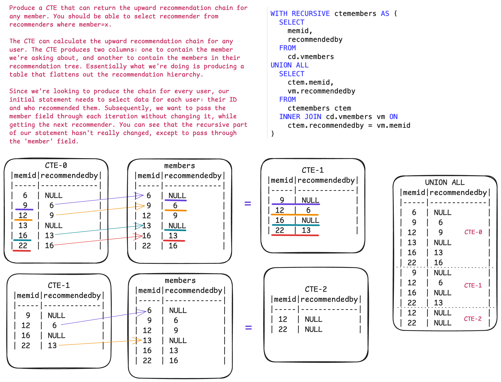

## SARGABLE (Search ARGument ABLE) Queries - Efficient use of Index

```sql
-- Bad:
SELECT ... WHERE Year (myDate) = 2008;
-- Fixed:
SELECT ... WHERE myDate >= '01-01-2008' AND myDate< '01-01-2009';

--Bad:
Select ... WHERE SUBSTRING(DealerName,4) = 'Ford';
-- Fixed:
Select ... WHERE DealerName Like 'Ford%';

-- Bad:
Select ... WHERE DateDiff(mm,OrderDate, GetDate()) >= 30;
-- Fixed:
Select ... WHERE OrderDate < DateAdd(mm, -30, GetDate());
```

- Avoid using functions or calculations on indexed columns in the WHERE clause
- Use direct comparisons when possible, instead of wrapping the column in a function
- If we need to use a function on a column, consider creating a computed column or a function-based index, if the database system supports

## Subqueries

ubqueries, also known as inner or nested queries, are queries embedded within another query. They are used to retrieve data that will be used by the main query. Subqueries can be categorized based on their return type and their relationship with the outer query.

### Categorization by Return Type:

- **Scalar Subquery**: Returns a single value (one row, one column).
```sql
  SELECT name FROM products WHERE price > (SELECT AVG(price) FROM products);
```

- **Row Subquery**: Returns a single row with multiple columns.
```sql
  SELECT * FROM orders WHERE (customer_id, order_date) = (
    SELECT id, MAX(order_date) FROM customers GROUP BY id LIMIT 1
  );
```

- **Column Subquery**: Returns a single column with multiple rows.
```sql
  SELECT name FROM employees WHERE department_id IN (
    SELECT id FROM departments WHERE location = 'New York'
  );
```

- **Table Subquery**: Returns a result set (multiple rows, multiple columns), often used in the FROM clause.
```sql
  SELECT a.name, b.total_orders FROM customers AS a
  JOIN (
    SELECT customer_id, COUNT(*) AS total_orders FROM orders GROUP BY customer_id
  ) AS b ON a.id = b.customer_id;
```

### Categorization by Relationship with Outer Query:

- **Non-Correlated (or Nested) Subquery**: This subquery executes independently of the outer query and its result is used by the outer query. It runs only once.
```sql
  SELECT name FROM products WHERE category_id IN (
    SELECT id FROM categories WHERE name = 'Electronics'
  );
```

- **Correlated Subquery**: A correlated subquery is a nested query that uses values from the outer query. It is evaluated for each row processed by the outer query, making it a row-by-row operation. This makes them useful for row-specific comparisons but can impact performance because the subquery runs repeatedly. The inner query is dependent on the outer query, referencing columns from the outer query's tables.
```sql
  SELECT name, price FROM products p1 WHERE price > (
    SELECT AVG(price) FROM products p2 WHERE p2.category_id = p1.category_id
  );
```

[PostgreSQL Exercises](https://pgexercises.com)

## CASE WHEN THEN

```sql
CASE
  WHEN condition_1 THEN result_1
  WHEN condition_2 THEN result_2
  -- ... more WHEN clauses
  [ELSE else_result]
END;

select
  name,
  case
    when monthlymaintenance > 100 then 'expensive'
    else 'cheap'
  end as cost
from cd.facilities;
```

## DISTINCT

Specifying **DISTINCT** after SELECT removes duplicate rows from the result set. Note that this applies to rows: if row A has multiple columns, row B is only equal to it if the values in all columns are the same. As a general rule, don't use DISTINCT in a willy-nilly fashion - it's not free to remove duplicates from large query result sets, so do it as-needed.

```sql
select DISTINCT firstname, surname, joindate
  from cd.members
  where joindate =
    (select max(joindate)
      from cd.members);
```

## Joining with USING

The USING clause provides a shorthand for specifying join conditions when the joining columns have the same name in both tables involved in the join.

When you use JOIN ... USING (column_name), PostgreSQL automatically creates an equality condition for the specified column_name between the two tables. For example, T1 JOIN T2 USING (a, b) is equivalent to T1 JOIN T2 ON T1.a = T2.a AND T1.b = T2.b.

When using USING, the common columns are presented as a single output column in the result set, rather than appearing twice (once from each table). This eliminates ambiguity and reduces redundancy in the output.

## BETWEEN

```sql
select b.starttime, f.name from cd.bookings as b
inner join cd.facilities as f on f.facid = b.facid
where name like 'Tennis Court%' and
  -- starttime >= '2012-09-21' and starttime < '2012-09-22'
  starttime between '2012-09-21' and '2012-09-22'
order by b.starttime;
```

## CONCAT & ||

```sql
select DISTINCT
  -- CONCAT(m.firstname, ' ', m.surname) as member,
  m.firstname || ' ' || m.surname as member,
  f.name
from cd.members as m
inner join cd.bookings as b
  on b.memid = m.memid
inner join cd.facilities as f
  on f.facid = b.facid
  and f.name like 'Tennis Court%'
order by member;
```

## Subquery & Common Table Expression (CTE)

CTE is a temporary, named result set defined within the scope of a single SQL statement. It is a powerful feature for enhancing query readability, modularity, and sometimes performance, especially in complex or recursive queries. CTEs are temporary, existing only for the duration of the query in which they are defined. They are given a name, allowing them to be referenced multiple times, just like a regular table or view, within the same query.

```sql
WITH cte_name (column1, column2, ...) AS (
    SELECT expression1, expression2, ...
    FROM table_name
    WHERE condition
),
another_ste AS (SELECT...)
SELECT *
FROM cte_name
WHERE another_condition;
```

```sql
-- 3. CTE: Multiple tables
WITH mp AS (SELECT category, MAX(price) AS max_price
            FROM menu_ items
            GROUP BY category) ,
     ci AS (SELECT *
            FROM menu_items
            WHERE item_name LIKE '%Chicken%')
SELECT *
FROM ci LEFT JOIN mp
ON ci.category = mp.category
```

**Recursive CTE** allows you to define a temporary, named result set that can refer to itself, making it suitable for querying hierarchical or self-referential data structures. A recursive CTE is defined using the **WITH RECURSIVE** clause and typically consists of two parts:
- **Non-recursive term (Anchor Member)**: This is the base case of the recursion. It defines the initial set of rows for the CTE and does not refer to the CTE itself.
- **Recursive term**: This part refers back to the CTE itself and builds upon the results generated by the previous iteration. It is connected to the non-recursive term using UNION or UNION ALL.

```sql
WITH RECURSIVE NAME(columns) as (
	<initial statement>
	UNION ALL
	<recursive statement>
)

WITH RECURSIVE subordinates AS (
    -- Non-recursive term: Find the direct subordinates of the initial manager
    SELECT
        employee_id,
        employee_name,
        manager_id,
        1 AS level
    FROM
        employees
    WHERE
        manager_id = <initial_manager_id>

    UNION ALL

    -- Recursive term: Find subordinates of the previously found subordinates
    SELECT
        e.employee_id,
        e.employee_name,
        e.manager_id,
        s.level + 1 AS level
    FROM
        employees e
    JOIN
        subordinates s ON e.manager_id = s.employee_id
)
SELECT
    employee_id,
    employee_name,
    level
FROM
    subordinates
ORDER BY
    level, employee_name;
```

```sql
WITH RECURSIVE numbers(nums) AS (
  SELECT 1 -- Base case: start with 1
  UNION ALL
  SELECT nums + 1
  FROM numbers
  WHERE nums < 5 -- Recursive step: increment
)
SELECT * FROM numbers;

WITH RECURSIVE my_dates(dt) AS (SELECT '2024-06-01'
                                UNION ALL
                                SELECT dt + INTERVAL 1 DAY
                                FROM my_dates
                                WHERE dt < '2024-06-06')
SELECT d.dt, COALESCE(s.price, LAG(price) OVER())
FROM my_dates d LEFT JOIN stock_prices s ON d.dt = s.date;
```

```sql
-- Find the upward recommendation chain for member ID 27: that is, the member who recommended them, and the member who recommended that member, and so on.
with recursive mem as (
  select
    memid,
    firstname,
    surname,
    recommendedby
  from cd.members
  where memid = 27
  union all
  select
    r.memid,
    r.firstname,
    r.surname,
    r.recommendedby
  from cd.members r
  inner join mem on mem.recommendedby = r.memid
)
select
  memid as recommender,
  firstname,
  surname
from mem
where memid != 27;

-- Alternativa
with recursive recommenders (recommender) as (
  select recommendedby
  from cd.members
  where memid = 27
  union all
  select mems.recommendedby
  from
    recommenders recs
    inner join cd.members mems on mems.memid = recs.recommender
)
select
  recs.recommender,
  mems.firstname,
  mems.surname
from
  recommenders recs
  inner join cd.members mems on recs.recommender = mems.memid
order by
  memid desc;

-- Find the downward recommendation chain for member ID 1: that is, the members they recommended, the members those members recommended, and so on.
with recursive mem as (
  select
    memid,
    firstname,
    surname,
    recommendedby
  from cd.members
  where recommendedby = 1
  union all
  select
    r.memid,
    r.firstname,
    r.surname,
    r.recommendedby
  from cd.members r
  inner join mem on mem.memid = r.recommendedby
)
select
  memid,
  firstname,
  surname
from mem
order by memid;

-- Alternative
WITH RECURSIVE recommendeds (memid) AS (
  SELECT memid
  FROM cd.members
  WHERE recommendedby = 1
  UNION ALL
  SELECT mems.memid
  FROM
    recommendeds recs
    INNER JOIN cd.members mems ON mems.recommendedby = recs.memid
)
SELECT
  recs.memid,
  mems.firstname,
  mems.surname
FROM
  recommendeds recs
  INNER JOIN cd.members mems ON recs.memid = mems.memid
ORDER BY
  memid;

-- Produce a CTE that can return the upward recommendation chain for any member. You should be able to select recommender from recommenders where member=x.
WITH RECURSIVE recommenders (recommender, member) AS (
  SELECT
    recommendedby,
    memid
  FROM
    cd.members
  UNION ALL
  SELECT
    mems.recommendedby,
    recs.member
  FROM
    recommenders recs
    INNER JOIN cd.members mems ON mems.memid = recs.recommender
)
SELECT
  recs.member member,
  recs.recommender,
  mems.firstname,
  mems.surname
FROM
  recommenders recs
  INNER JOIN cd.members mems ON recs.recommender = mems.memid
WHERE
  recs.member = 22 OR recs.member = 12
ORDER BY
  recs.member asc,
  recs.recommender desc;
```



```sql
select
  m.firstname || ' ' || m.surname as member,
  f.name as facility,
  case
    when m.memid = 0 then f.guestcost * b.slots
    else f.membercost * b.slots
  end as cost
from cd.members as m
inner join cd.bookings as b
  on b.memid = m.memid
  and b.starttime between '2012-09-14' and '2012-09-15'
inner join cd.facilities as f
  on f.facid = b.facid
where
  (m.memid = 0 and f.guestcost * b.slots > 30) or
  (m.memid != 0 and f.membercost * b.slots > 30)
order by cost desc;

-- Subquery Version
select * from (
    select
        m.firstname || ' ' || m.surname as member,
        f.name as facility,
        case
            when m.memid = 0 then f.guestcost * b.slots
            else f.membercost * b.slots
        end as cost
    from cd.members as m
    inner join cd.bookings as b
        on b.memid = m.memid
        and b.starttime between '2012-09-14' and '2012-09-15'
    inner join cd.facilities as f
        on f.facid = b.facid
)
where cost > 30
order by cost desc;

-- Common Table Expression (CTE) Version
WITH results as (
    select
        m.firstname || ' ' || m.surname as member,
        f.name as facility,
        case
            when m.memid = 0 then f.guestcost * b.slots
            else f.membercost * b.slots
        end as cost
    from cd.members as m
    inner join cd.bookings as b
        on b.memid = m.memid
        and b.starttime between '2012-09-14' and '2012-09-15'
    inner join cd.facilities as f
        on f.facid = b.facid
)
select * from results
where cost > 30
order by cost desc;
```

## INSERT

```sql
insert into cd.facilities
    (facid, name, membercost, guestcost, initialoutlay, monthlymaintenance)
    SELECT 9, 'Spa', 20, 30, 100000, 800
    UNION ALL
        SELECT 10, 'Squash Court 2', 3.5, 17.5, 5000, 80;
```

```sql
insert into cd.facilities values
((
    select max(facid) + 1 from cd.facilities
),'Spa', 20, 30, 100000, 800);

-- Alternative
insert into cd.facilities
    (facid, name, membercost, guestcost, initialoutlay, monthlymaintenance)
    select (select max(facid) from cd.facilities)+1, 'Spa', 20, 30, 100000, 800;
```

## UPDATE...FROM

```sql
update cd.facilities facs
    set
        membercost = facs2.membercost * 1.1,
        guestcost = facs2.guestcost * 1.1
    from (select * from cd.facilities where facid = 0) facs2
    where facs.facid = 1;
```

## DELETE

```sql
delete from cd.members where memid not in (select memid from cd.bookings);

-- Alternative: correlated subquery
delete from cd.members mems where not exists (select 1 from cd.bookings where memid = mems.memid);
```

## Common Table Expression (CTE) (WITH)

```sql
with sum as (
  select facid, sum(slots) as totalslots
  from cd.bookings
  group by facid
)
select facid, totalslots
  from sum
  where totalslots = (select max(totalslots) from sum);
```

## ROLLUP & CUBE (GROUPING SETS)

ROLLUP is an extension to the GROUP BY clause that provides a shorthand for defining multiple grouping sets, specifically for creating hierarchical summaries of data. It is particularly useful for generating subtotals and a grand total in reports.

ROLLUP assumes a hierarchical relationship between the columns specified within its parentheses. It generates grouping sets based on this hierarchy, progressively aggregating the data from the most detailed level to the grand total.

```sql
SELECT
    column1,
    column2,
    aggregate_function(column3)
FROM
    table_name
GROUP BY
    ROLLUP (column1, column2);
```

Explanation:

- The columns listed within ROLLUP() define the hierarchy. For example, ROLLUP(column1, column2) would first group by column1 and column2, then by column1 alone, and finally provide a grand total.
- aggregate_function() is used to calculate summary values (e.g., SUM(), AVG(), COUNT()).
- The result set will include rows for each level of aggregation, with NULL values appearing in the columns that are not part of the current grouping level, indicating subtotals or the grand total.

While both ROLLUP and CUBE are used for generating multiple grouping sets, ROLLUP focuses on hierarchical aggregation, generating a subset of possible grouping sets based on the defined hierarchy. CUBE, on the other hand, generates all possible combinations of grouping sets from the specified columns, providing a more comprehensive but potentially larger result set.

```sql
select
  facid,
  extract(month from starttime) as month,
  sum(slots) as slots
from cd.bookings
where starttime between '2012-01-01' and '2013-01-01'
group by rollup(facid, month)
order by facid, month
```

## TO_CHAR

```sql
select
  f.facid,
  f.name,
  trim(to_char(sum(b.slots)/2.0, '999999D99')) as slots
from cd.bookings as b
inner join cd.facilities as f on
  f.facid = b.facid
group by f.facid
order by f.facid
```

## Window functions

Window functions operate on the result set of your (sub-)query, after the WHERE clause and all standard aggregation. They operate on a window of data.

```sql
select
  count(*) over() as count,
  firstname,
  surname
from cd.members
order by joindate
```

By default this is unrestricted: the entire result set, but it can be restricted to provide more useful results. For example, suppose instead of wanting the count of all members, we want the count of all members who joined in the same month as that member:

```sql
select count(*) over(partition by date_trunc('month',joindate)),
  firstname, surname
  from cd.members
order by joindate
```

In this example, we partition the data by month. For each row the window function operates over any rows that have a joindate in the same month. The window function thus produces a count of the number of members who joined in that month.

You can go further. Imagine if, instead of the total number of members who joined that month, you want to know what number joinee they were that month. You can do this by adding in an ORDER BY to the window function:

```sql
 count(*) over(partition by date_trunc('month',joindate) order by joindate),
  firstname, surname
  from cd.members
order by joindate
```

The ORDER BY changes the window again. Instead of the window for each row being the entire partition, the window goes from the start of the partition to the current row, and not beyond. Thus, for the first member who joins in a given month, the count is 1. For the second, the count is 2, and so on.

One final thing that's worth mentioning about window functions: you can have multiple unrelated ones in the same query. Try out the query below for an example - you'll see the numbers for the members going in opposite directions! This flexibility can lead to more concise, readable, and maintainable queries.

```sql
 count(*) over(partition by date_trunc('month',joindate) order by joindate asc),
  count(*) over(partition by date_trunc('month',joindate) order by joindate desc),
  firstname, surname
  from cd.members
order by joindate
```

### ROW_NUMBER

It is a window function that assigns a unique, sequential integer to each row within a result set or a specified partition of that result set. This function is commonly used for tasks such as ranking, pagination, and identifying duplicates.

```sql
ROW_NUMBER() OVER (
  [PARTITION BY expression_list]
  [ORDER BY expression_list]
)
```

- **OVER** clause: This is essential for all window functions. It defines the "window" or set of rows over which the function operates.
- **PARTITION BY** expression_list (Optional): This clause divides the result set into smaller, independent groups called partitions. If PARTITION BY is used, ROW_NUMBER() restarts its numbering from 1 for each new partition. If omitted, the entire result set is treated as a single partition.
- **ORDER BY** expression_list: This clause specifies the order in which rows within each partition (or the entire result set) are numbered. This order determines how the sequential integers are assigned.

To assign a row number to each employee based on their salary in descending order:

```sql
SELECT
  employee_id,
  first_name,
  last_name,
  salary,
  ROW_NUMBER() OVER (ORDER BY salary DESC) AS row_num
FROM
    employees;
```

To assign a row number to each employee within their respective departments, ordered by salary within each department:

```sql
SELECT
  employee_id,
  first_name,
  last_name,
  department_id,
  salary,
  ROW_NUMBER() OVER (PARTITION BY department_id ORDER BY salary DESC) AS row_num_in_department
FROM
  employees;
```

### RANK

It is a window function used to assign a rank to each row within a specified partition of a result set. It's particularly useful for ranking items based on certain criteria, such as finding top performers, generating leaderboards, or sorting data by highest values.

Handling Ties: If multiple rows have the same value for the ranking criteria, they receive the same rank. However, **RANK** will skip the subsequent rank(s), creating gaps in the ranking sequence. For example, if two rows tie for rank 3, both will receive rank 3, and the next rank assigned will be 5 (rank 4 is skipped). on the other hand, **DENSE_RANK** does not skip rank numbers when there are ties, for example, if two rows tie for rank 1, they both get rank 1, and the next distinct value gets rank 2. (e.g., 1, 1, 2, 3)

```sql
RANK() OVER (
    [PARTITION BY partition_expression, ...]
    ORDER BY sort_expression [ASC | DESC], ...
)
```

To rank students by their scores within each class:

```sql
SELECT
    student_name,
    class_id,
    score,
    RANK() OVER (PARTITION BY class_id ORDER BY score DESC) as rank_in_class
FROM
    student_scores;
```

Output the facility id that has the highest number of slots booked

```sql
select facid, sum(slots) as total
from cd.bookings
group by facid
order by total desc
limit 1;

with result as
(
  select facid, sum(slots) as total
  from cd.bookings
  group by facid
)
select * from result
where total = (select max(total) from result);

select facid, total from (
  select facid, sum(slots) total, rank() over (order by sum(slots) desc) rank
  from cd.bookings
  group by facid
) as ranked
where rank = 1 ;

select facid, sum(slots) as totalslots
from cd.bookings
group by facid
having sum(slots) = (
  select max(sum2.totalslots) from
  (
    select sum(slots) as totalslots
    from cd.bookings
    group by facid
  ) as sum2
);

select facid, total from (
  select facid, total, rank() over (order by total desc) rank from (
    select facid, sum(slots) total
    from cd.bookings
    group by facid
  ) as sumslots
) as ranked
where rank = 1;
```

Rank members by (rounded) hours used

```sql
with result as
(
  select
    firstname,
    surname,
    ((sum(slots)+10)/20)*10 as hours
  from cd.members as m
  inner join cd.bookings as b using(memid)
  group by memid
)
select *, rank() over (order by hours desc) as rank from  result
order by rank asc, surname, firstname;

select firstname, surname, hours, rank() over (order by hours desc) from
  (select firstname, surname,
    ((sum(bks.slots)+10)/20)*10 as hours
    from cd.bookings bks
    inner join cd.members mems
      on bks.memid = mems.memid
    group by mems.memid
  ) as subq
order by rank, surname, firstname;
```

Find the top three revenue generating facilities

```sql
with result as
(
select
  name,
  sum(
  case
      when memid = 0 then guestcost * slots
      else membercost * slots
    end
  ) as revenue
from cd.facilities
inner join cd.bookings using(facid)
group by name
)
select name, rank() over (order by revenue desc) as rank
from result
limit 3;

select name, rank from (
  select facs.name as name, rank() over (order by sum(case
        when memid = 0 then slots * facs.guestcost
        else slots * membercost
      end) desc) as rank
    from cd.bookings bks
    inner join cd.facilities facs
      on bks.facid = facs.facid
    group by facs.name
  ) as subq
  where rank <= 3
order by rank;
```

### NTILE

Used to divide an ordered set of rows into a specified number of ranked groups, often called "buckets" or "tiles," as equally sized as possible. It assigns a bucket number (starting from 1) to each row within these groups.

``` sql
NTILE(num_tiles) OVER (
    [PARTITION BY partition_expression, ...]
    ORDER BY sort_expression [ASC | DESC], ...
)
```

- **num_tiles**: An integer representing the desired number of groups or buckets to divide the rows into.

How it Works:
- **Ordering**: Rows are first ordered according to the ORDER BY clause within each partition (if specified).
- **Division**: The ordered rows are then divided into num_tiles groups.
- **Assignment**: Each row is assigned a bucket number from 1 to num_tiles, indicating which group it belongs to.
- **Handling Unequal Sizes**: If the total number of rows (or rows within a partition) is not perfectly divisible by num_tiles, the NTILE() function distributes the remaining rows by placing them into the initial buckets, making those buckets slightly larger than the later ones.

- Data Segmentation: Dividing data into deciles, quartiles, or other equal-sized groups for analysis.
- Percentile Calculations: While NTILE() itself doesn't directly calculate percentiles, it can be used as a building block for percentile-like analysis by dividing data into 100 tiles.
- Ranking and Reporting: Creating reports that categorize items into specific performance tiers or groups based on a particular metric.

```sql
select
  name,
  case
    when tile = 1 then 'high'
    when tile = 2 then 'average'
    when tile = 3 then 'low'
  end as revenue
from (
  select name, NTILE(3) over (order by revenue desc) as tile
  from
    (
    select
      name,
      sum(
      case
          when memid = 0 then guestcost * slots
          else membercost * slots
        end
      ) as revenue
    from cd.facilities
    inner join cd.bookings using(facid)
    group by name
  ) order by tile, name
);

select name, case when class=1 then 'high'
    when class=2 then 'average'
    else 'low'
    end revenue
  from (
    select facs.name as name, ntile(3) over (order by sum(case
        when memid = 0 then slots * facs.guestcost
        else slots * membercost
      end) desc) as class
    from cd.bookings bks
    inner join cd.facilities facs
      on bks.facid = facs.facid
    group by facs.name
  ) as subq
order by class, name;
```

### Analytic Functions

LAG(): Accesses data from a preceding row within the partition.
LEAD(): Accesses data from a subsequent row within the partition.
FIRST_VALUE(), LAST_VALUE(): Retrieves the first or last value in the window frame.

```sql
LAG(value [, offset [, default ]]) OVER (
    [PARTITION BY expression [, ...]]
    ORDER BY expression [ASC | DESC | USING operator] [, ...]
)
```

```sql
SELECT
    year,
    product,
    amount,
    LAG(amount, 1, 0) OVER (PARTITION BY product ORDER BY year) AS previous_year_amount,
    (amount - LAG(amount, 1, 0) OVER (PARTITION BY product ORDER BY year)) AS sales_difference
FROM
    sales;
```

## Complex JOINs

Calculate the payback time for each facility, based on the 3 complete months of data so far.

```sql
with revenues as
(
  select
    facid,
    sum(
    case
        when memid = 0 then guestcost * slots
        else membercost * slots
      end
    ) as revenue
  from cd.facilities
  inner join cd.bookings using(facid)
  group by facid
)
select
  name,
  initialoutlay / (revenue/3 - monthlymaintenance) as months
from revenues
inner join cd.facilities using(facid)
order by name;
---

select
  facs.name as name,
  facs.initialoutlay/((sum(case
      when memid = 0 then slots * facs.guestcost
      else slots * membercost
    end)/3) - facs.monthlymaintenance) as months
  from cd.bookings bks
  inner join cd.facilities facs
    on bks.facid = facs.facid
  group by facs.facid
order by name;
---

select
  name,
  initialoutlay / (monthlyrevenue - monthlymaintenance) as repaytime
  from
  (
    select
      facs.name as name,
      facs.initialoutlay as initialoutlay,
      facs.monthlymaintenance as monthlymaintenance,
      sum(case
        when memid = 0 then slots * facs.guestcost
        else slots * membercost
      end)/3 as monthlyrevenue
    from cd.bookings bks
    inner join cd.facilities facs
      on bks.facid = facs.facid
    group by facs.facid
  ) as subq
order by name;
---

with monthdata as (
  select
    mincompletemonth,
    maxcompletemonth,
    (extract(year from maxcompletemonth)*12) +
      extract(month from maxcompletemonth) -
      (extract(year from mincompletemonth)*12) -
      extract(month from mincompletemonth) as nummonths
  from (
    select
      date_trunc('month',
        (select max(starttime) from cd.bookings)) as maxcompletemonth,
      date_trunc('month',
        (select min(starttime) from cd.bookings)) as mincompletemonth
  ) as subq
)
select 	name,
  initialoutlay / (monthlyrevenue - monthlymaintenance) as repaytime
  from
    (
      select
        facs.name as name,
        facs.initialoutlay as initialoutlay,
        facs.monthlymaintenance as monthlymaintenance,
        sum(case
          when memid = 0 then slots * facs.guestcost
          else slots * membercost
        end)/(select nummonths from monthdata) as monthlyrevenue
      from cd.bookings bks
      inner join cd.facilities facs
        on bks.facid = facs.facid
      where bks.starttime < (select maxcompletemonth from monthdata)
      group by facs.facid
    ) as subq
order by name;
```

## GENERATE_SERIES

It is a powerful set-returning function used to generate a series of values. It can produce sequences of numbers (integers, bigints, or numerics) or date/time values (dates, timestamps, or timestamptz).

```sql
generate_series(start, stop[, step]);
```

- **start**: The starting value of the series (inclusive).
- **stop**: The ending value of the series (inclusive, if it aligns with the step).
- **step** (optional): The increment value between consecutive elements in the series. If omitted, the default step is 1 for numeric series and 1 unit of the respective date/time type for date/time series (e.g., 1 day for dates).

```sql
SELECT generate_series(1, 5);
SELECT generate_series(1, 10, 2);
SELECT generate_series('2025-01-01'::date, '2025-01-05'::date, '1 day'::interval);
SELECT generate_series('2025-01-01 00:00:00'::timestamp, '2025-01-01 06:00:00'::timestamp, '1 hour'::interval);
```

Calculate a rolling average of total revenue. For each day in August 2012, calculate a rolling average of total revenue over the previous 15 days.

```sql
select
  dategen.date,
  (
    -- correlated subquery that, for each day fed into it,
    -- finds the average revenue for the last 15 days
    select
      sum(
        case
          when memid = 0 then slots * facs.guestcost
          else slots * membercost
        end
      ) as rev
    from
      cd.bookings bks
      inner join cd.facilities facs on bks.facid = facs.facid
    where
      bks.starttime > dategen.date - interval '14 days'
      and bks.starttime < dategen.date + interval '1 day'
  ) / 15 as revenue
from
  (
    -- generates a list of days in august
    select
      cast(
        generate_series(timestamp '2012-08-01', '2012-08-31', '1 day') as date
      ) as date
  ) as dategen
order by
  dategen.date;

select
  date,
  avgrev
from
  (
    -- AVG over this row and the 14 rows before it.
    select
      dategen.date as date,
      avg(revdata.rev) over (order by dategen.date rows 14 preceding) as avgrev
    from
      -- generate a list of days.  This ensures that a row gets generated
      -- even if the day has 0 revenue.  Note that we generate days before
      -- the start of october - this is because our window function needs
      -- to know the revenue for those days for its calculations.
      (
        select
          cast(
            generate_series(timestamp '2012-07-10', '2012-08-31', '1 day') as date
          ) as date
      ) as dategen
      left outer join
      -- left join to a table of per-day revenue
      (
        select
          cast(bks.starttime as date) as date,
          sum(
            case
              when memid = 0 then slots * facs.guestcost
              else slots * membercost
            end
          ) as rev
        from
          cd.bookings bks
          inner join cd.facilities facs on bks.facid = facs.facid
        group by
          cast(bks.starttime as date)
      ) as revdata on dategen.date = revdata.date
  ) as subq
where
  date >= '2012-08-01'
order by
  date;
```

## VIEW

**Views** are virtual tables defined by a stored query. They do not store data themselves, but rather provide a way to present data from one or more underlying tables (called base tables) in a specific, predefined format. When a view is queried, PostgreSQL executes the underlying query to retrieve the data from the base tables. Views can encapsulate complex SELECT statements involving joins, aggregations, and filtering, allowing users to query the view as if it were a simple table without needing to understand the underlying complexity.

```sql
CREATE OR REPLACE VIEW view_name AS
SELECT column1, column2, ...
FROM table_name
WHERE condition;
```

**Materialized views** differs from standard views in that they actually store the result of the defining query physically on disk. This can significantly improve query performance for complex or frequently accessed data, especially in data warehousing or reporting scenarios. However, materialized views need to be periodically refreshed to reflect changes in the underlying base tables.

```sql
CREATE OR REPLACE MATERIALIZED VIEW materialized_view_name AS
SELECT column1, column2, ...
FROM table_name
WHERE condition;

REFRESH MATERIALIZED VIEW materialized_view_name;
```

```sql
create or replace view cd.dailyrevenue as
select
  cast(bks.starttime as date) as date,
  sum(
    case
      when memid = 0 then slots * facs.guestcost
      else slots * membercost
    end
  ) as rev
from
  cd.bookings bks
  inner join cd.facilities facs on bks.facid = facs.facid
group by
  cast(bks.starttime as date);

select
  date,
  avgrev
from
  (
    select
      dategen.date as date,
      avg(revdata.rev) over (order by dategen.date rows 14 preceding) as avgrev
    from
      (
        select
          cast(
            generate_series(timestamp '2012-07-10', '2012-08-31', '1 day') as date
          ) as date
      ) as dategen
      left outer join cd.dailyrevenue as revdata on dategen.date = revdata.date
  ) as subq
where
  date >= '2012-08-01'
order by
  date;
```

## CAST & ::

the **CAST** function or the **::** operator is used to explicitly convert a value from one data type to another. This is essential when the data type of a value needs to conform to the requirements of an operation, a function, or a target column.

```sql
  CAST ( expression AS target_type );
  expression::target_type;

  SELECT CAST('123' AS INTEGER);
  SELECT '123'::INTEGER;

  SELECT CAST('2023-01-01' AS DATE);
  SELECT '2023-01-01'::DATE;

  SELECT CAST(42 AS float8);
  SELECT 42::float8;
```

## PREPARE statement

It is a server-side object that allows for the pre-compilation and optimization of SQL queries. This feature is particularly beneficial for queries that are executed repeatedly with varying parameters. The **PREPARE** statement defines the prepared statement, including the SQL query and optional parameter types. During this stage, PostgreSQL parses, analyzes, and rewrites the query, storing this pre-processed form.

```sql
  PREPARE my_statement (INT, VARCHAR) AS
  SELECT * FROM my_table WHERE id = $1 AND name = $2;
```

In this example, $1 and $2 are placeholders for parameters that will be provided during execution.

The **EXECUTE** statement runs the previously prepared statement, providing the actual values for the parameters.

```sql
    EXECUTE my_statement(123, 'John Doe');
```

During execution, PostgreSQL plans and executes the query using the pre-compiled form and the supplied parameter values.
- **Performance**: By avoiding repetitive parsing, analyzing, and rewriting for each execution, prepared statements can significantly improve performance, especially for frequently run queries.
- **Session Scope**: Prepared statements are specific to the current database session and are automatically deallocated when the session ends.
- **Parameter Types**: When defining a prepared statement, you can optionally specify the data types of the parameters. If not specified, PostgreSQL will infer the types from the context.
- **DEALLOCATE**: You can explicitly deallocate a prepared statement using the DEALLOCATE command to free up server resources before the session ends.

## Table Partitioning

Table partitioning allows you to divide a large table into smaller, more manageable pieces called partitions. This can improve performance for certain query patterns and make maintenance tasks easier.

First, create the main table, specifying the partitioning method and the column(s) to partition by. PostgreSQL supports RANGE, LIST, and HASH partitioning.

```sql
    CREATE TABLE sales (
        id SERIAL,
        sale_date DATE NOT NULL,
        amount NUMERIC,
        PRIMARY KEY (id, sale_date) -- Composite primary key required for partitioned tables
    ) PARTITION BY RANGE (sale_date);
```

In this example, sales is the parent table, and it is partitioned by sale_date using the RANGE method.

Next, create the individual partitions (child tables) that belong to the parent table. Each partition must specify the values or ranges of the partition key it will hold.

```sql
    CREATE TABLE sales_2023 PARTITION OF sales
    FOR VALUES FROM ('2023-01-01') TO ('2024-01-01');

    CREATE TABLE sales_2024 PARTITION OF sales
    FOR VALUES FROM ('2024-01-01') TO ('2025-01-01');
```

These statements create two partitions for the sales table, one for sales in 2023 and another for 2024. The FOR VALUES FROM ... TO ... clause defines the range for each partition. Note that the upper bound is exclusive.

  - **RANGE**: Partitions are defined by ranges of values in a key column or set of columns (e.g., dates, numeric IDs).
  - **LIST**: Partitions are defined by explicitly listing the key value(s) that belong to each partition (e.g., specific regions, product categories).
  - **HASH**: Partitions are defined by a hash function applied to the partition key, distributing rows evenly across partitions.

- Primary Keys: If you define a primary key on a partitioned table, it must include all partition key columns.
- Indexes: Create indexes on the partitioned table, and they will automatically be created on all partitions.
- Default Partition: You can optionally create a DEFAULT partition to handle rows that do not fall into any defined partition.
- Existing Tables: To partition an existing monolithic table, you must create a new partitioned table, migrate the data, and then replace the old table with the new one.

## Timestamp

```sql
select timestamp '2012-08-31 01:00:00';
select '2012-08-31 01:00:00'::timestamp;
select cast('2012-08-31 01:00:00' as timestamp);

select timestamp '2012-08-31 01:00:00' - timestamp '2012-07-30 01:00:00' as interval;

select generate_series('2012-10-01'::date, '2012-10-31'::date, interval '1 day') as ts;
select generate_series(timestamp '2012-10-01', timestamp '2012-10-31', interval '1 day') as ts;

select to_char('2012-08-31'::date, 'DD') as date_part;
select extract(day from timestamp '2012-08-31');

select extract(epoch from (timestamp '2012-09-02 00:00:00' - '2012-08-31 01:00:00')); -- Seconds: Postgres-specific trick
select
  extract(day from ts.int) * 60 * 60 * 24 +
  extract(hour from ts.int) * 60 * 60 +
  extract(minute from ts.int) * 60 +
  extract(second from ts.int)
from
  (
    select timestamp '2012-09-02 00:00:00' - '2012-08-31 01:00:00' as int
  ) ts;

-- days in each month of 2012
select
  extract(month from dates.date) as month,
  count(*) || ' days' as length
  -- extract(day from max(date) over (partition by extract(month from date))) as length
from (
  select generate_series(timestamp '2012-01-01', '2012-12-31', interval '1 day') as date
) as dates
group by month
order by month;

select
  extract(month from cal.month ) as month,
  (cal.month + interval '1 month') - cal.month as length
from
  (
    select generate_series (timestamp '2012-01-01', timestamp '2012-12-01', interval '1 month') as month
  ) cal
order by month;

--  days remaining in the month
select
  (
    (date_trunc('month', data.date) + interval '1 month') -
    date_trunc('day', data.date)
  ) as interval
from (
  select '2012-02-11 01:00:00'::date as date
) as data;

-- Return a list of the start and end time of the last 10 bookings
select
  starttime,
  (starttime + slots*(interval '30 minutes')) endtime
from cd.bookings
order by endtime desc, starttime desc
limit 10;

-- Return a count of bookings for each month
select
  date_trunc('month', starttime) as month,
  count(*) as count
from cd.bookings
group by month
order by month;

-- Work out the utilisation percentage for each facility by month
select
  name,
  month,
  round(
    (100 * slots) / cast(25 * (cast((month + interval '1 month') as date) - cast(month as date)) as numeric),
    1
  ) as utilisation
from
  (
    select
      facs.name as name,
      date_trunc('month', starttime) as month,
      sum(slots) as slots
    from
      cd.bookings bks
      inner join cd.facilities facs on bks.facid = facs.facid
    group by facs.facid, month
  ) as inn
order by name, month
```

## Strings

``` sql
select * from cd.facilities where upper(name) like 'TENNIS%';

select memid, telephone from cd.members where telephone ~ '[()]';

select LPAD(cast(zipcode as char(5)), 5, '0') as zip from cd.members order by zipcode;

select
  substring(surname from 1 for 1) as letter,
  count(*)
from cd.members
group by letter
order by letter;


```

### Regular expressions (POSIX)

PostgreSQL provides robust support for regular expressions, enabling powerful pattern matching and manipulation of string data within your database. This functionality is crucial for tasks such as data validation, cleaning, and advanced searching.

Pattern Matching Operators:
  - **~**: Matches a regular expression (case-sensitive).
  - **~***: Matches a regular expression (case-insensitive).
  - **!~**: Does not match a regular expression (case-sensitive).
  - **!~***: Does not match a regular expression (case-insensitive).

Functions for Regular Expressions
- **regexp_match(string, pattern [, flags])**: Returns an array of text values representing the first match of the pattern and its capture groups within the string.
- **regexp_matches(string, pattern [, flags])**: Returns a set of text arrays, each representing a match of the pattern and its capture groups within the string.
- **regexp_replace(string, pattern, replacement [, flags])**: Replaces all occurrences of a pattern within a string with a specified replacement string.
- **regexp_split_to_array(string, pattern [, flags])**: Splits a string into an array of substrings based on a delimiter defined by a regular expression.
- **regexp_split_to_table(string, pattern [, flags])**: Splits a string into a set of rows, with each row containing a substring based on a regular expression delimiter.

```sql
-- Find telephone numbers with parentheses
select memid, telephone from cd.members where telephone like '(%)%';
select memid, telephone from cd.members where telephone ~ '[()]';

-- Select names that start with 'J' (case-insensitive)
SELECT name FROM users WHERE name ~* '^J';

-- Replace all digits with 'X' in a string
SELECT regexp_replace('Product123', '\d', 'X', 'g'); -- 'g' flag for global replacement

-- Extract hashtags from a social media post
SELECT regexp_matches('Check out #PostgreSQL and #Regex!', '#([A-Za-z0-9_]+)', 'g');

select
  memid,
  REGEXP_REPLACE(telephone, '[^0-9]', '', 'g')
from cd.members
```

### SIMILAR TO

SIMILAR TO operator is a pattern-matching operator that returns TRUE if its pattern matches the entire given string, and FALSE otherwise. It interprets the pattern using a subset of SQL standard's regular expression syntax. Unlike LIKE, which uses only _ (single character) and % (zero or more characters) as wildcards, SIMILAR TO supports a wider range of pattern-matching metacharacters taken from POSIX regular expressions. These include:

  - |: Alternation (either of two alternatives).
  - *: Repetition of the previous item zero or more times.
  - +: Repetition of the previous item one or more times.
  - ?: Repetition of the previous item zero or one time.
  - {m}, {m,}, {m,n}: Specific repetition counts.
  - Parentheses (): Grouping items.

A SIMILAR TO expression must match the whole string, not just a substring as in posix regular expressions. This means that you'll typically end up bracketing an expression in '%' characters. The '.' character does not mean 'any character' in SIMILAR TO regexes: it's just a plain character.

```sql
select memid, telephone from cd.members where telephone similar to '%[()]%';

SELECT 'abc' SIMILAR TO 'a%'; -- TRUE (matches the entire string)
SELECT 'abc' SIMILAR TO 'a'; -- FALSE (does not match the entire string)
SELECT 'abc' SIMILAR TO '%(b|d)%'; -- TRUE (matches 'b' within the string)
```

### TRANSLATE

Reemplazar un conjunto de caracteres por otro dentro de una cadena de texto. Funciona reemplazando cada carácter en la cadena from_set por el carácter correspondiente en la cadena to_set.

```sql
TRANSLATE(string, from_set, to_set)

select memid, translate(telephone, '-() ', '') as telephone
  from cd.members
  order by memid;
```
