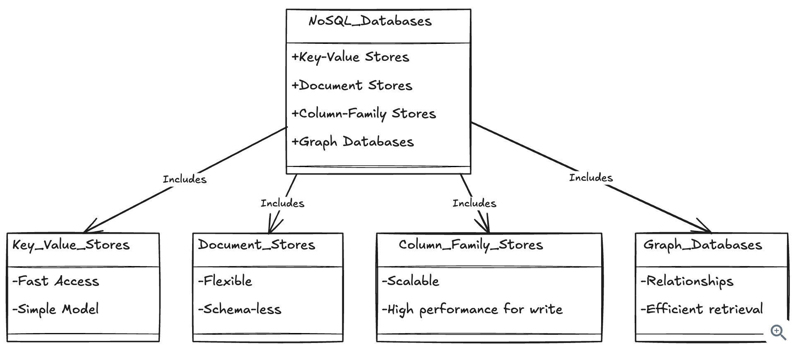
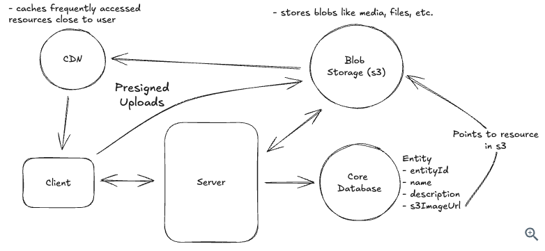
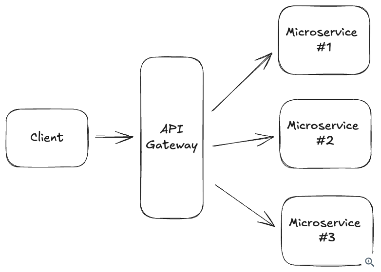
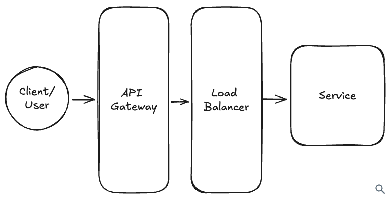
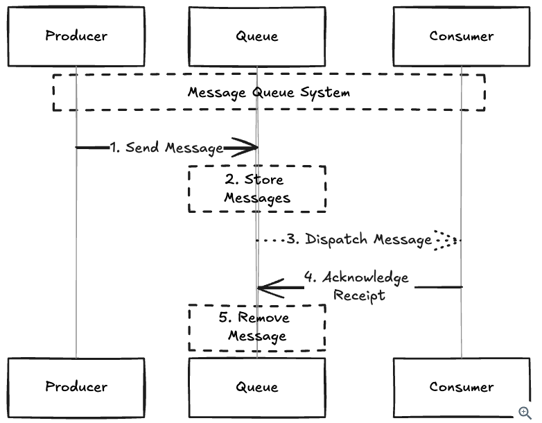

## [System Design in a Hurry](https://www.hellointerview.com/learn/system-design/in-a-hurry/introduction)

### A. Introduction

- Assembling the right pieces: you'll need to know some core concepts, key technologies, and common patterns. On this base, you'll establish a strategy or delivery framework for executing the interview.


### Types of System Design Interviews


- ### Product Design

Sometimes called "Product Architecture" interviews, or ambiguously "System Design" interviews, are the most common type of system design interview.You'll be asked to design a system behind a product. For example, design the backend for a chat application, or the backend for a ride sharing application. Often these interviews are described in terms of a "use case" - for example, "design the backend for a chat application that supports 1:1 and group chats". Example Questions:
  - Design a ride-sharing service like Uber
  - Design a chat application like Slack
  - Design a social network like Facebook

- ### Infrastructure Design

Are less common than product design interviews. You'll be asked to design a system that supports a particular infrastructure use case. For example, design a message broker or a rate limiter. These interviews are deeper in the stack, your interviewer will be looking for more emphasis on system-level mastery (e.g. consensus algorithms, durability considerations) than high-level design. Example Questions:
  - Design a rate limiter
  - Design a message broker
  - Design a key-value store

- ### Object Oriented Design

Sometimes called "Low Level Design", are less common than product design interviews, but still occur at companies that use an object-oriented language like Java (Amazon is notable for these interviews). You'll be asked to design a system that supports a particular use-case, but the emphasis on the interview is assembling the correct class structure, adhering to SOLID principles, coming up with a sensible entity design, etc. For example, design a Parking Lot reservation system or a Vending Machine, but rather than breaking this problem down into services and describing the backend database you're instead asked to describe the class structure of a solution. We instead recommend [Grokking the Low Level Design Interview](https://www.educative.io/courses/grokking-the-low-level-design-interview-using-ood-principles). Example Questions:
  - Design a parking lot reservation system
  - Design a vending machine
  - Design an elevator control system

- ### Frontend Design

Are focused on the architecture of a complex frontend application. Are most common with specialized frontend engineering roles at larger companies. For example, you might be asked to design the frontend for a spreadsheet application or a video editor. We instead recommend you try [Great Frontend for both material and practice problems for frontend design interviews](https://www.greatfrontend.com/). Example Questions:
  - Design the frontend for a spreadsheet application
  - Design the frontend for a video editor

### Interview Assessment

Important: Deliver a working system.

- ### Problem Navigation

Asses your ability to navigate a complex problem. You should be able to **break down the problem** into smaller, more manageable pieces, **prioritize** the most important ones, and then **navigate** through those pieces to a solution. This is often the most important part of the interview. The most common ways that candidates fail with this competency are:
  - Insufficiently **exploring the problem** and **gathering requirements**.
  - **Focusing** on uninteresting/trivial aspects of the problem vs the **most important** ones.
  - **Getting stuck** on a particular piece of the problem and not being able to **move forward**.

- ### High-Level Design

With a problem broken down, wow you can **solve each of pieces**. This is where your knowledge of the **Core Concepts** comes into play. You should be able to **describe how you would solve each piece** of the problem, and **how those pieces fit together** into a cohesive whole. The most common ways that candidates fail with this competency are:
  - Not having a **strong understanding of the core concepts** to solve the problem.
  - Ignoring **scaling** and **performance** considerations.
  - "Spaghetti design" - a solution that is not **well-structured** and difficult to **understand**.

- ### Technical Excellence

You'll need to know about **best practices**, **current technologies**, and **how to apply them**. This is where your knowledge of the **Key Technologies** is important. You should be able to describe how you would use current technologies, with well-recognized patterns, to solve the problems. The most common ways that candidates fail with this competency are:
  - Not knowing about **available technologies**.
  - Not knowing **how to apply those technologies** to the problem at hand.
  - Not recognizing **common patterns** and **best practices**.

- ### Communication and Collaboration

Interviews are frequently **collaborative**, and your interviewer will be looking to see how you work with them to solve the problem. This will include your **ability to communicate complex concepts**, respond to **feedback** and **questions**, and in some cases **work together** with the interviewer to solve the problem. The most common ways that candidates fail with this competency are:
  - Not being able to **communicate complex concepts** clearly.
  - Being defensive or argumentative when receiving **feedback**.
  - Getting lost in the weeds and not being able to **work with the interviewer** to solve the problem.

---

### B. How to Prepare for System Design Interviews

- **Build a Foundation**

  1. Understand what a [system design interview](https://www.hellointerview.com/learn/system-design/in-a-hurry/introduction) is
  2. Choose a [delivery framework](https://www.hellointerview.com/learn/system-design/in-a-hurry/delivery)
  3. Start with the basics: [Core Concepts](https://www.hellointerview.com/learn/system-design/in-a-hurry/core-concepts), [Key Technologies](https://www.hellointerview.com/learn/system-design/in-a-hurry/key-technologies), and [Common Patterns](https://www.hellointerview.com/learn/system-design/in-a-hurry/patterns)

- **Practice Practice Practice**

  1. [Choose a question](https://www.hellointerview.com/learn/system-design/in-a-hurry/how-to-prepare)
  2. Read the requirements
  3. Try to answer on your own
  4. Read the answer key
  5. Put your knowledge to the test

---

### C. Delivery Framework

The delivery framework is a sequence of steps and timings we recommend for your interview. By structuring your interview in this way, you'll stay focused on the bits that are most important to your interviewer. An added benefit is that you'll have a clear path to fall back if you're overwhelmed.


- ### Requirements (~5 minutes)

Get a clear understanding of the system that you are being asked to design. Break your requirements into two sections.

- **1. Functional Requirements**

Are your **"Users/Clients should be able to..."** statements. These are the **core features** of your system and should be the first thing you discuss with your interviewer. **Ask targeted questions** as if you were talking to a client, customer, or product manager ("does the system need to do X?", "what would happen if Y?") to arrive at a **prioritized list of core features**. For example, if you were designing a system like Twitter, you might have the following functional requirements:
  - Users should be able to post tweets
  - Users should be able to follow other users
  - Users should be able to see tweets from users they follow

Keep your requirements targeted! The main objective in the remaining part of the interview is to develop a system that meets the requirements you've identified -- so it's crucial to be strategic in your **prioritization**. Many of these systems have hundreds of features, but it's your job to **identify and prioritize the top 3**. Having a long list of requirements will hurt you more than it will help you and many top FAANGs directly evaluate you on your ability to **focus on what matters**.

- **2. Non-functional Requirements**

Are statements about the **system qualities** that are important to your users. These can be phrased as **"The system should be able to..."** or "The system should be..." statements. For example, if you were designing a system like Twitter, you might have the following non-functional requirements:
  - The system should be highly available, prioritizing availability over consistency
  - The system should be able to scale to support 100M+ DAU (Daily Active Users)
  - The system should be low latency, rendering feeds in under 200ms

It's important that non-functional requirements are put in the **context** of the system and, where possible, are **quantified**. For example, "the system should be low latency" is obvious and not very meaningful—nearly all systems should be low latency. "The system should have low latency search, < 500ms," is much more useful as it identifies the part of the system that most needs to be low latency and provides a target.

Here is a checklist of things to consider that might help you identify the most important non-functional requirements for your system. You'll want to identify the top 3-5 that are most relevant to your system.
1. **CAP Theorem**: Should your system prioritize **consistency** or **availability**? Note, **partition tolerance** is a given in distributed systems.
2. **Environment Constraints**: Are there any constraints on the environment in which your system will run? For example, are you running on a mobile device with limited battery life? Running on devices with limited memory or limited bandwidth (e.g. streaming video on 3G)?
3. **Scalability**: All systems need to scale, but does this system have unique scaling requirements? For example, does it have bursty traffic at a specific time of day? Are there events, like holidays, that will cause a significant increase in traffic? Also consider the read vs write ratio here. Does your system need to scale reads or writes more?
4. **Latency**: How quickly does the system need to respond to user requests? Specifically consider any requests that require meaningful computation. For example, low latency search when designing Yelp.
5. **Durability**: How important is it that the data in your system is not lost? For example, a social network might be able to tolerate some data loss, but a banking system cannot.
6. **Security**: How secure does the system need to be? Consider data protection, access control, and compliance with regulations.
7. **Fault Tolerance**: How well does the system need to handle failures? Consider redundancy, failover, and recovery mechanisms.
8. **Compliance**: Are there legal or regulatory requirements the system needs to meet? Consider industry standards, data protection laws, and other regulations.

- **3. Capacity Estimation**

We believe this is often unnecessary. Instead, perform calculations only if they will directly influence your design. In most scenarios, you're dealing with a large, distributed system – and it's reasonable to assume as much. When would it be necessary? Imagine you are designing a TopK system for trending topics in FB posts. You would want to estimate the number of topics you would expect to see, as this will influence whether you can use a single instance of a data structure like a min-heap or if you need to shard it across multiple instances, which will have a big impact on your design.

[Learning to estimate relevant quantities quickly](https://www.hellointerview.com/blog/mastering-estimation) will help you quickly reason through design trade-offs in your design.

- ### Core Entities (~2 minutes)

Identify and list the core entities of your system. This helps you to **define terms**, understand the **data central** to your design, and gives you a foundation to build on. These are the core entities that your **API will exchange** and that your system will **persist in a Data Model**. This is as simple bulleted list and explaining this is your first draft to the interviewer.

Why not list the entire data model at this point? Because you don't know what you don't know. As you design your system, you'll discover new entities and **relationships** that you didn't anticipate. By starting with a small list, you can quickly iterate and add to it as you go. Once you get into the high level design and have a clearer sense of exactly what state needs to update upon each request you can start to build out the list of relevant **columns/fields** for each entity.

For our Twitter example, our core entities are rather simple:
  - User
  - Tweet
  - Follow

A couple useful questions to ask yourself to help identify core entities:
  - Who are the **actors** in the system? Are they overlapping?
  - What are the **nouns or resources** necessary to satisfy the functional requirements?

Aim to choose **good names** for your entities.

- ### API or System Interface (~5 minutes)

Define the **contract** between your system and its users. This maps directly to the functional requirements you've already identified (but not always!). You will use this contract to guide your high-level design and to ensure that you're meeting the requirements you've identified.

You have a quick decision to make here -- which **API protocol** should you use?
- **REST (Representational State Transfer)**: Uses HTTP verbs (GET, POST, PUT, DELETE) to perform CRUD operations on resources. This should be your **default choice** for most interviews.
- **GraphQL**: Allows clients to specify exactly what data they want to receive, avoiding over-fetching and under-fetching. Choose this when you have diverse clients with different data needs.
- **RPC (Remote Procedure Call)**: Action-oriented protocol (like gRPC) that's faster than REST for service-to-service communication. Use for internal APIs when performance is critical.

Real-time features, you'll also need *WebSockets* or *Server-Sent Events*, but design your core API first.

For Twitter, we would choose REST and design our endpoints using our core entities as resources. Resources should be **plural nouns** that represent things in your system:

```
POST /v1/tweets
body: {
  "text": string
}

GET /v1/tweets/{tweetId} -> Tweet

POST /v1/users/{userId}/follows

GET /v1/feed -> Tweet[]
```

Notice how we use **plural resource names** (tweets, not tweet) and put the userId in the path for the follow endpoint since it's required to identify which user to follow. The tweet endpoint doesn't include userId because we get that from the **authentication token** in the request header.

Never rely on **sensitive information** like user IDs from request bodies when they should come from authentication. Always authenticate requests and derive the current user from the auth token, not from user input.

- ### Data Flow [Optional] (~5 minutes)

For some backend systems, especially **data-processing systems**, it can be helpful to describe the high level **sequence of actions or processes** that the system performs on the **inputs** to produce the desired **outputs**.

We usually define the data flow via a **simple list**. You'll use this flow to inform your high-level design in the next section. For a web crawler, this might look like:
  1. Fetch seed URLs
  2. Parse HTML
  3. Extract URLs
  4. Store data
  5. Repeat

- ### High Level Design (~10-15 minutes)

This consists of **drawing** boxes and arrows to represent the different components of your system and how they **interact**. **Components** are basic building blocks like servers, databases, caches, etc.

Don't over think this! Your primary goal is to design an architecture that **satisfies the API** you've designed and, thus, the **requirements** you've identified. In most cases, you can even go one-by-one through your **API endpoints** and build up your design sequentially to satisfy each one.

Stay focused! It's incredibly common for candidates to start layering on complexity too early, resulting in them never arriving at a complete solution. Focus on a relatively **simple design** that meets the **core functional requirements**, and then layer on complexity to satisfy the non-functional requirements in your deep dives section. It's natural to identify areas where you can add complexity, like caches or message queues, while in the high-level design. We encourage you to note these areas with a simple verbal callout and written note, and then move on.

As you're drawing your design, you should be talking through your **thought process** with your interviewer. Be explicit about how data flows through the system and what state (either in databases, caches, message queues, etc.) changes with each request, starting from API **requests** and ending with the **response**. When your request reaches your database or persistence layer, it's a great time to start **documenting** the relevant columns/fields for each entity. You can do this directly next to your database visually. This helps keep it close to the relevant components and makes it easy to evolve as you iterate on your design. No need to worry too much about types here.

Don't waste your time documenting every column/field in your schema. For example, your interviewer knows that a User table has a name, email, and password hash so you don't need to write these down. Instead, focus on the columns/fields that are particularly relevant to your design.

For our simple Twitter example, here is how you might build up your design, one endpoint at a time:


- ### Deep Dives (~10 minutes)

Now that you have a high-level design in place you're going to use the remaining 10 or so minutes of the interview to harden your design by
  (a) ensuring it meets all of your **non-functional requirements**
  (b) addressing **edge cases**
  (c) identifying and addressing **issues and bottlenecks** and
  (d) **improving** the design based on probes from your interviewer

So for example, one of our non-functional requirements for Twitter was that our system needs to scale to >100M DAU. We could then lead a discussion oriented around **horizontal scaling**, the introduction of **caches**, and **database sharding** -- updating our design as we go. Another was that feeds need to be fetched with low **latency**. We'd lead a discussion about **fanout-on-read** vs **fanout-on-write** and the use of caches.

A common mistake candidates make is that they try to talk over their interviewer here. Make sure you give your interviewer room to ask questions and probe your design. Chances are they have specific signals they want to get from you and you're going to miss it if you're too busy talking. Plus, you'll hurt your evaluation on communication and collaboration.


### D. Core Concepts

- ### Scaling

**Horizontal scaling** is all about adding more machines to a system to increase its capacity. This is in contrast to **vertical scaling**, which is the process of adding more resources to a single machine to increase its capacity.


Vertical scaling actually requires significantly **less incremental complexity**. If you can estimate your workload and determine that you can scale vertically for the foreseeable future, this is often a better solution than horizontal scaling. Many systems can scale vertically to a surprising degree.

By scaling you're forced to contend with the **distribution of work, data, and state** across your system. This is a common source of yellow flags in system design interviews.

Inexperienced candidates tend to make two mistakes:
  - (1) they leap to horizontal scaling to solve any performance problem, even when it's not necessary, and
  - (2) they don't consider the implications of horizontal scaling on the rest of the system.

When you encounter a scaling bottleneck, make sure you're not throwing machines at a poor design.

When horizontal scaling is the right solution, you'll need to consider **how to distribute work across your machines**. Most modern systems use a technique called **"Consistent Hashing"** to distribute work across a set of machines - this is a technique that arranges both data and machines in a circular space called a **"hash ring"**, allowing you to add or remove machines with minimal data redistribution.

  - **Work Distribution**

The first challenge of horizontal scaling is getting the work to the right machine. This is often done via a **load balancer**, which will choose which node from a group to use for an incoming request. While load balancers often come with many different **strategies** (e.g. **least connections**, **utilization-based**, etc), simple **round robin** allocation is often sufficient. For **asynchronous jobs work**, this is often done via a **queueing system**.

Work distribution needs to try to keep load on the system as **even** as possible. For example, if you're using a **hash map** to distribute work across a set of nodes, you might find that one node is getting a disproportionate amount of work because of the distribution of incoming requests. The scalability of your system ultimately depends on how effectively you can remediate this. If one node is 90% busy and the remaining are 10% busy, you're not getting much out of your horizontal scaling.

  - **Data Distribution**

For some systems, this implies keeping data in-memory on the node that's processing the request. More frequently, this implies keeping data in a database that's shared across all nodes.

Look for ways to partition your data such that a single node can access the data it needs **without needing to talk to another node**. If you do need to talk to other nodes (a concept known as **"fan-out"**), keep the number small.

A common anti-pattern is to have requests which fan out to many different nodes and then the results are all gathered together. This **"scatter gather"** pattern can be problematic because it can lead to a lot of network traffic, is sensitive to failures in each connection, and suffers from tail latency issues if the final result is dependent on every response.

If your system design problem involves **geography**, there's a good chance you have the option to partition by some sort of REGION_ID. For many systems that involve physical locations, this is a great way to scale because for many problems a given user will only be concerned with data in or around a particular **location** (e.g. a user in the US doesn't need to know about data in Europe).

Inherently, horizontal scaling on data introduces **synchronization challenges**. You're either reading and writing data to a shared database which is a network hop away (≈ 1-10ms, ideally) or you're keeping multiple redundant copies across each of your servers. This means **race conditions** and **consistency challenges**! Most database systems are built to resolve some of these problems directly (e.g. by using **transactions**). In other cases, you may need to use a [Distributed Lock](https://www.hellointerview.com/learn/system-design/in-a-hurry/key-technologies#distributed-lock). Regardless, you'll need to be prepared to discuss how you're going to keep your data [Consistent](https://www.hellointerview.com/learn/system-design/deep-dives/cap-theorem).

- ### [CAP Theorem](https://www.hellointerview.com/learn/system-design/deep-dives/cap-theorem)

Is a fundamental concept in distributed systems that states you can only have two of three properties: Consistency, Availability, and Partition tolerance. In practice, since network partitions are unavoidable, this means choosing between consistency and availability.

Choosing **consistency** means that all nodes in your system will see the **same data at the same time**. When a write occurs, all subsequent reads will return that value, regardless of which node they hit. However, during a network partition, some nodes may become unavailable to maintain this consistency guarantee.

On the other hand, opting for **availability** means that **every request will receive a response**, even during network partitions. The tradeoff is that different nodes may temporarily have **different versions of the data**, leading to inconsistency. The system will eventually reconcile these differences, but there's no guarantee about when this will happen.

In a system design interview, availability should be your default choice. You only **need strong consistency** in systems where **reading stale data is unacceptable**.

Examples of systems that require strong consistency include:
- **Inventory management systems**, where stock levels need to be precisely tracked to avoid overselling products
- **Booking systems** for limited resources (airline seats, event tickets, hotel rooms) where you need to prevent double-booking
- **Banking systems** where the balance of an account must be consistent across all nodes to prevent fraud

Don't feel pressured to choose a single consistency model for your entire system. **Different features often have different requirements**. In an e-commerce system, product descriptions can be eventually consistent while inventory counts and order processing need strong consistency to prevent overselling.

- ### Locking

Locking is the process of ensuring that **only one client can access a shared resource at a time**.
Locks happen at every scale of computer systems: there are locks in your operating system kernel, locks in your applications, locks in the database, and even distributed locks - hence they are a common topic in system design interviews. Locks are important for **enforcing the correctness** of our system but can be **disastrous for performance**.

In most system design interviews, you'll be forced to contend with locks when you consider race conditions. A **race condition** is a situation where multiple clients are trying to access the same resource at the same time. This can lead to data corruption, lost updates, and other bad things.

There's three things to worry about when employing locks:

  - **Granularity of the lock**

We want locks to be as **fine-grained as possible**. This means that we want to **lock as little as possible** to ensure that we're not blocking other clients from accessing the system. For example, if we're updating a user's profile, we want to lock only that user's profile and not the entire user table.

  - **Duration of the lock**

We want locks to be held for **as short a time as possible**. This means that we want to lock only for the duration of the critical section. For example, if we're updating a user's profile, we want to lock only for the duration of the update and not for the entire request.

  - **Whether we can bypass the lock**

In many cases, we can avoid locking by employing an "optimistic" concurrency control strategy, especially if the work to be done is either read-only or can be retried. In an **optimistic strategy** we're going to assume that we can do the work without locking and then check to see if we were right. In most systems, we can use a "compare and swap" operation to do this.

Optimistic concurrency control makes the assumption that most of the time we won't have contention (or multiple people trying to lock at the same time) in a system, which is a good assumption for many systems! That said, not all systems can use optimistic concurrency control. For example, if you're updating a user's bank account balance, you can't just assume that you can do the update without locking.

- ### Indexing

Indexing is the process of **creating a data structure that makes reads faster**.

The most basic method of indexing is simply keeping our data in a **hash map** by a specific key. When we need to grab data by that key, we can do so in O(1) time. Suddenly we don't need to scan the entire dataset to find the data we need.

Another way of indexing is to keep our data in a **sorted list**. This allows us to do binary search to find the data we need in O(log n) time. This is a common way of indexing data in databases.

  - **Indexing in Databases**

Most questions of indexing will happen inside your database. Depending on your database choice, you'll have different options for indexing. For example, most relational databases allow you to create indexes on any column or group of columns in a table. This isn't unbounded, however. While databases like DynamoDB allow you to create many secondary indexes, for databases like Redis you're on your own to design and implement your own indexing strategy.
If you can do your indexing in your primary database, do it! Databases have been battle-honed over decades for exactly this problem, so don't reinvent the wheel unless you have to.

  - **Specialized Indexes**

In addition to the basic indexing strategies, there are many specialized indexes that are used to solve specific problems. For example, **geospatial indexes** are used to index location data. This is useful for systems that need to do things like find the nearest restaurant or the nearest gas station. **Vector databases** are used to index high-dimensional data. This is useful for systems that need to do things like find similar images or similar documents. And **full-text indexes** are used to index text data. This is useful for systems that need to do things like search for documents or search for tweets.

[ElasticSearch](https://www.hellointerview.com/learn/system-design/deep-dives/elasticsearch) is our recommended solution for these secondary indexes, when it can work. ElasticSearch supports full-text indexes (search by text) via Lucene, geospatial indexes, and even vector indexes. You can set up ElasticSearch to index most databases via **Change Data Capture (CDC)** where the ES cluster is listening to changes coming from the database and updating its indexes accordingly. This isn't a perfect solution! By using CDC, you're introducing a new point of failure and a new source of latency, the data read out of your search index is going to be stale, but that may be ok.

It's very common for candidates to introduce ElasticSearch as a potential solution to their problem without understanding its limitations or explaining how it's used. Make sure you brush up on the fundamentals so that you're ready on interview day.


- ### Communication Protocols

You've got two different categories of protocols to handle: internal and external.
  - Internally, for a typical microservice application which constitutes 90%+ of system design problems, either HTTP(S) or gRPC will do the job.
  - Externally, you'll need to consider how your clients will communicate with your system: who initiates the communication, what are the latency considerations, and how much data needs to be sent.


  - Use **HTTP(S) for APIs** with simple request and responses. Because each request is **stateless**, you can **scale** your API **horizontally** by placing it behind a **load balancer**. Make sure that your services aren't assuming dependencies on the state of the client (e.g. sessions) and you're good to go.

  - If you need to give your clients near-realtime updates, you'll need a way for the clients to receive updates from the server. **Long polling** is a great way to do this that blends the simplicity and scalability of HTTP with the realtime updates of Websockets. With long polling, the client makes a request to the server and the server holds the request open until it has new data to send to the client. Once the data is sent, the client makes another request and the process repeats. Notably, you can use standard load balancers and firewalls with long polling - no special infrastructure needed.

  - **Websockets** are necessary if you need realtime, bidirectional communication between the client and the server. From a system design perspective, websockets can be challenging because you need to maintain the connection between client and server. This can be a challenge for load balancers and firewalls, and it can be a challenge for your server to maintain many open connections. A common pattern in these instances is to use a **message broker** to handle the communication between the client and the server and for the backend services to communicate with this message broker. This ensures you don't need to maintain long connections to every service in your backend.

  - **Server Sent Events (SSE)** are a great way to send updates from the server to the client. They're similar to long polling, but they're more efficient for unidirectional communication from the server to the client. SSE allows the server to push updates to the client whenever new data is available, without the client having to make repeated requests as in long polling. This is achieved through a single, long-lived HTTP connection, making it more suitable for scenarios where the server frequently updates data that needs to be sent to the client. Unlike Websockets, SSE is designed specifically for server-to-client communication and does not support client-to-server messaging. This makes SSE simpler to implement and integrate into existing HTTP infrastructure, such as load balancers and firewalls, without the need for special handling.

**Statefulness** is a major source of complexity for systems. Where possible, relegating your state to a message broker or a database is a great way to simplify your system. This enables your services to be stateless and horizontally scalable while still maintaining stateful communication with your clients.

- ### Security

When designing production systems, security should be top of mind. You should be prepared to discuss how you'll secure your system at every level. Some of the most common security concerns are:

  - **Authentication / Authorization**

In many systems you'll expose an API to external users which needs to be locked down to only specific users. Delegating this work to either an **API Gateway** or a **dedicated service like Auth0** is a great way to ensure that you're not reinventing the wheel. Your interviewer may want you to discuss the finer details like how specific entities are secured, but often it's sufficient to say "My API Gateway will handle authentication and authorization".

  - **Encryption**

You'll want to cover both the data in transit (e.g. via **protocol encryption**) and the data at rest (e.g. via **storage encryption**). **HTTPS** is the SSL/TLS protocol that encrypts data in transit and is the standard for web traffic. If you're using gRPC it supports SSL/TLS out of the box. For data at rest, you'll want to use a **database that supports encryption** or **encrypt** the data yourself **before storing** it.

For sensitive data, it can often be useful for the **end-user to control the keys**. This is a common pattern in systems that need to store sensitive data. For example, if you're building a system that stores user data, you might want to encrypt that data with a key that's unique to each user. This way, even if your database is compromised, the data is still secure.

  - **Data Protection**

Data protection is the process of ensuring that **data is protected from unauthorized access, use, or disclosure**. Frequently, production systems are concerned with data that's sensitive when exposed but might not be within an authorization path (e.g. a user's data might be exposed via a createFriendRequest endpoint). Many exposures of this sort are discovered by scraping endpoints, so having some sort of **rate limiting** or **request throttling** is a good idea.

- ### Monitoring

The idea here is simple: candidates who understand monitoring are more likely to have experience with actual systems in production. Monitoring real systems is also a great way to learn about how systems actually scale (and break).

Monitoring generally occurs at 3 levels, and it's useful to name them.

  - **Infrastructure Monitoring**

Infrastructure monitoring is the process of monitoring the health and performance of your infrastructure. This includes things like **CPU usage**, **memory usage**, **disk usage**, and **network usage**. This is often done with a tool like **Datadog** or **New Relic**. While a disk usage alarm may not break down your service, it's usually a leading indicator of problems that need to be addressed.

  - **Service-Level Monitoring**

Service-level monitoring is the process of monitoring the health and performance of your services. This includes things like **request latency**, **error rates**, and **throughput**. If your service is taking too long to respond to requests, it's likely that your users are having a bad time. If throughput is spiking, it may be that you're handling more traffic or your system may be misbehaving.

  - **Application-Level Monitoring**

Application-level monitoring is the process of monitoring the health and performance of your application. This includes things like the **number of users**, the **number of active sessions**, and the **number of active connections**. This could also include key business metrics for the business. This is often done with a tool like **Google Analytics** or Mixpanel. This is often the most important level of monitoring for product design interviews.


### E. Key Technologies

- ### Core Database

The most common are relational databases (e.g. Postgres) and NoSQL databases (e.g. DynamoDB) - we recommend you pick one of these for your interview. If you are taking predominantly **product** design interviews, we recommend you pick a **relational** database. If you are taking predominantly **infrastructure** design interviews, we recommend you pick a **NoSQL** database.

Many candidates trip themselves up by trying to insert a comparison of relational and NoSQL databases into their answer. The reality is that these two technologies are highly overlapping and broad statements like "I need to use a relational database because I have relationships in my data" (NoSQL databases can work great for this) or "I've gotta use NoSQL because I need scale and performance" (relational databases, used correctly, perform and scale incredibly well) are often yellow flags that reveal inexperience.

Here's the truth: most interviewers **don't need an explicit comparison** of SQL and NoSQL databases in your session and it's a pothole you should completely avoid. Instead, talk about what you know about the database you're using and **how it will help you solve the problem** at hand. If you're asked to compare, focus on the differences in the databases you're familiar with and how they would impact your design. So "I'm using Postgres here because its ACID properties will allow me to maintain data integrity" is a great opener.

  - **Relational Databases**

Sometimes called **RDBMS** or Relational Database Management Systems, are the most common type of database. They're often used for **transactional data** (e.g. user records, order records, etc) and are typically the default choice for a product design interview. Relational databases store your data in **tables**, which are composed of **rows** and **columns**. Each row represents a single record, and each column represents a single field on that record. Relational databases are often queried using **SQL**, a declarative language for querying data.

The most important features are:
  1. **SQL Joins**: Joins are a way of combining data from multiple tables. For example, if you have a users table and a posts table, you might want to query for all posts by a particular user. This is important for querying data and SQL databases can support arbitrary joins between tables. Note that joins can be also be a major performance bottleneck in your system so minimize them where possible.
  2. **Indexes**: Indexes are a way of storing data in a way that makes it **faster to query**. For example, if you have a users table with a name column, you might create an index on the name column. This would allow you to query for users by name much faster than if you didn't have an index. Indexes are often implemented using a **B-Tree** or a **Hash Table**. The great thing about relational databases is (a) their support for arbitrarily **many indexes**, which allows you to optimize for different queries and (b) their support for **multi-column and specialized indexes** (e.g. geospatial indexes, full-text indexes).
  3. **RDBMS Transactions**: Transactions are a way of grouping multiple operations together into a single **atomic operation**. For example, if you have a users table and a posts table, you might want to create a new user and a new post for that user at the same time. If you do this in a transaction, either both operations will succeed or both will fail. This ensures you don't have invalid data like a post from a user who doesn't exist!

The most common relational databases are Postgres and MySQL. We recommend you pick **Postgres** and we have a great [deep-dive to help you with the details](https://www.hellointerview.com/learn/system-design/deep-dives/postgres), but either one is fine.

The Four ACID Properties

  1. **Atomicity**: This "all-or-nothing" property ensures that all operations within a transaction are completed fully or not at all. If any part of the transaction fails, the entire transaction is rolled back, and the database is returned to its previous state.
  2. **Consistency**: This property ensures that a transaction brings the database from one valid state to another. It prevents transactions from leaving the database in an inconsistent or invalid state, even after an error.
  3. **Isolation**: This property ensures that concurrent transactions do not interfere with each other. Each transaction executes as if it were the only one running, preventing issues like dirty reads or corrupted data from other incomplete transactions.
  4. **Durability**: This property guarantees that once a transaction has been successfully committed, its changes are permanent and will persist even in the event of a system failure.

Why ACID Transactions Are Important

  a. **Data Integrity**: ACID properties are crucial for maintaining the integrity of data, especially in systems like banking, where accuracy is paramount.
  b. **Reliability**: They provide a reliable framework for handling database operations, ensuring data correctness and consistency across the database.
  c. **Error Recovery**: In the event of errors, power failures, or other issues, ACID properties allow the database to recover to a consistent state, preventing data loss.

  - **NoSQL Databases**

NoSQL databases are a broad category of databases designed to accommodate a wide range of data models, including key-value, document, column-family, and graph formats. Unlike relational databases, NoSQL databases **do not use a traditional table-based structure** and are often schema-less. This flexibility allows NoSQL databases to **handle large volumes of unstructured, semi-structured, or structured data**, and to **scale horizontally** with ease.



NoSQL databases are strong candidates for situations where:

  a. **Flexible Data Models**: Your data model is evolving or you need to store different types of data structures without a fixed schema.
  b. **Scalability**: Your application needs to scale horizontally (across many servers) to accommodate large amounts of data or high user loads.
  c. **Handling Big Data and Real-Time Web Apps**: You have applications dealing with large volumes of data, especially unstructured data, or applications requiring real-time data processing and analytics.

The places where NoSQL databases excel are not necessarily places where relational databases fail (and vice-versa). For example, while NoSQL databases are great for handling unstructured data, relational databases can also have JSON columns with flexible schemas. While NoSQL databases are great for scaling horizontally, relational databases can also scale horizontally with the right architecture. When you're discussing NoSQL databases in your system design interview, make sure you're not making broad statements but instead discussing the specific features of the database you're using and how they will help you solve the problem at hand.

Things you should know about NoSQL databases

  1. **Data Models**: NoSQL databases come in many different flavors, each with its own data model. The most common types of NoSQL databases are key-value stores, document stores, column-family stores, and graph databases.
  2. **Consistency Models**: NoSQL databases offer various consistency models ranging from strong to eventual consistency. Strong consistency ensures that all nodes in the system have the same data at the same time, while eventual consistency ensures that all nodes will eventually have the same data.
  3. **Indexing**: NoSQL databases support indexing to make data faster to query. The most common types of indexes are B-Tree and Hash Table indexes.
  4. **Scalability**: NoSQL databases scale horizontally by using consistent hashing and/or sharding to distribute data across many servers.
    - [Consistent hashing](http://highscalability.com/blog/2023/2/22/consistent-hashing-algorithm.html) is a distributed systems technique that operates by assigning the data objects and nodes a position on a virtual ring structure (hash ring). Consistent hashing minimizes the number of keys to be remapped when the total number of nodes changes.
    - [Sharding](https://www.mongodb.com/features/database-sharding-explained) is a method for distributing a single dataset across multiple databases, which can then be stored on multiple machines. This allows for larger datasets to be split into smaller chunks and stored in multiple data nodes, increasing the total storage capacity of the system. See more on the basics of sharding here.

What are the most common NoSQL databases?

The most common NoSQL databases are DynamoDB, Cassandra, and [MongoDB](https://www.mongodb.com/). [DynamoDB](https://www.hellointerview.com/learn/system-design/deep-dives/dynamodb) is one of our favorites due to the breadth of features and how widely accepted it is. [Cassandra](https://www.hellointerview.com/learn/system-design/deep-dives/cassandra) is a good choice for write-heavy workloads due to its append-only storage model, but comes with some tradeoffs in functionality.

- ### Blob Storage

Sometimes you'll need to store large, unstructured blobs of data. This could be **images, videos, or other files**. You should use a blob storage service like [Amazon S3](https://aws.amazon.com/pm/serv-s3/) or [Google Cloud Storage](https://cloud.google.com/storage).

Blob storage services are simple. You can **upload a blob of data** and that **data is stored** and **get back a URL**. You can then **use this URL to download** the blob of data. Often times blob storage services **work in conjunction with CDNs**, so you can get fast downloads from anywhere in the world. Upload a file/blob to blob storage which will act as your origin, and then use a **CDN to cache** the file/blob in edge locations around the world.

In a typical setup you will have a core database like Postgres or DynamoDB that has pointers (just a url) to the blobs stored in S3. This allows you to use the database to query and index the data with very low latency, while still getting the benefits of cheap blob storage.

A very common setup when dealing with large binary artifacts looks like this:



To upload:
  - When clients want to upload a file, they request a presigned URL from the server.
  - The server returns a presigned URL to the client, recording it in the database.
  - The client uploads the file to the presigned URL.
  - The blob storage triggers a notification to the server that the upload is complete and the status is updated.

To download:
  - The client requests a specific file from the server and are returned a presigned URL.
  - The client uses the presigned URL to download the file via the CDN, which proxies the request to the underlying blob storage.

  1. **Durability**: Blob storage services are designed to be incredibly durable. They use techniques like replication and erasure coding to ensure that your data is safe even if a disk or server fails.
  2. **Scalability**: Hosted blob storage solutions like AWS S3 can be considered infinitely scalable. They can store an unlimited amount of data and can handle an unlimited number of requests (obviously within the limits of your account). You don't need to explicitly consider the scalability -- consider this as a given.
  3. **Cost**: Blob storage services are designed to be cost effective. For example, AWS S3 charges $0.023 per GB per month for the first 50 TB of storage. This is much cheaper than storing the same data in a database like DynamoDB, which charges $1.25 per GB per month for the first 10 TB of storage.
  4. **Security**: Blob storage services have built-in security features like encryption at rest and in transit. They also have access control features that allow you to control who can access your data.
  5. **Upload and Download Directly from the Client**: Blob storage services allow you to upload and download blobs directly from the client. This is useful for applications that need to store and retrieve large blobs of data, like images or videos. Familiarize yourself with presigned URLs and how they can be used to grant temporary access to a blob -- either for upload or download.
  6. **Chunking**: When uploading large files, it's common to use chunking to upload the file in smaller pieces. This allows you to resume an upload if it fails partway through, and it also allows you to upload the file in parallel. This is especially useful for large files, where uploading the entire file at once might take a long time. Modern blob storage services like S3 support chunking out of the box via the **multipart upload API**.

The most popular blob storage services are **Amazon S3**, **Google Cloud Storage**, and [Azure Blob](https://azure.microsoft.com/en-us/products/storage/blobs). All of these services are designed to be fast, durable, and cost effective. They also have a range of features like versioning, lifecycle policies, and access control.

- ### Search Optimized Database

**Full-text search** is the ability to search through a large amount of text data and find relevant results. This is different from a traditional database query, which is usually based on exact matches or ranges. Without a search optimized database, you would need to run a query that looks something like this:

```sql
SELECT * FROM documents WHERE document_text LIKE '%search_term%'
```

This query is slow and inefficient, and it doesn't scale well because it requires a full table scan. That means the database has to grab each record and test it against your predicate rather than relying on an index or lookup. Slow!

**Search optimized databases** are specifically designed to handle full-text search. They use techniques like **indexing**, **tokenization**, and **stemming** to make search queries fast and efficient. In short, they work by building what are called [inverted indexes](https://www.hellointerview.com/learn/system-design/deep-dives/elasticsearch#lucene-segment-features). **Inverted indexes** are a data structure that **maps from words to the documents that contain them**. This allows you to quickly find documents that contain a given word. A simple example of an inverted index might look like this:

```json
{
  "word1": [doc1, doc2, doc3],
  "word2": [doc2, doc3, doc4],
  "word3": [doc1, doc3, doc4]
}
```

Now, instead of scanning the entire table, the database can quickly look up the word in the query and find all the matching documents. Fast!

  - **Inverted Indexes:** An inverted index is a data structure that maps from words to the documents that contain them. This allows you to quickly find documents that contain a given word.
  - **Tokenization:** Tokenization is the process of breaking a piece of text into individual words. This allows you to map from words to documents in the inverted index.
  - **Stemming:** Stemming is the process of reducing words to their **root form**. This allows you to match different forms of the same word. For example, "running" and "runs" would both be reduced to "run".
  - **Fuzzy Search:** Fuzzy search is the ability to find results that are **similar** to a given search term. This works by using algorithms that can **tolerate** slight **misspellings** or **variations** in the search term. This is achieved through techniques like **edit distance calculation**, which measures how many letters need to be changed, added, or removed to transform one word into another.
  - **Scaling:** Search optimized databases scale by **adding more nodes** to a **cluster** and **sharding data** across those nodes.

The clear leader in this space is [Elasticsearch](https://www.elastic.co/elasticsearch/). You can learn more in our [Elasticsearch deep dive](https://www.hellointerview.com/learn/system-design/deep-dives/elasticsearch), but in short: **Elasticsearch** is a distributed, RESTful search and analytics engine that is built on top of **Apache Lucene**. It is designed to be fast, scalable, and easy to use, and is the most popular search optimized database and is used by companies like Netflix, Uber, and Yelp.

- ### API Gateway

An API gateway sits in front of your system and is responsible for **routing** incoming requests to the appropriate backend service. For example, if the system receives a request to *GET /users/123*, the API gateway would route that request to the users **service** and return the **response** to the client. The gateway is also typically responsible for handling cross-cutting concerns like **authentication**, **rate limiting**, and **logging**. it is a good idea to include an API gateway in your design as the **first point of contact for your clients**.



You're free to read more in our [API Gateway deep dive](https://www.hellointerview.com/learn/system-design/deep-dives/api-gateway), but note that interviewers rarely get into detail of the API gateway, they'll usually want to ask questions which are more specific to the problem at hand.

- ### Load Balancer

Most system design problems will require you to design a system that can **handle a large amount of traffic**. When you have a large amount of traffic, you will need to **distribute that traffic across multiple machines** (called **horizontal scaling**) to avoid overloading any single machine or creating a hotspot. For the purposes of an interview, you can assume that your load balancer is a black box that will distribute work across your system. The reality is that you need a load balancer wherever you have multiple machines capable of handling the same request.



Note that sometimes you'll need to have specific features from your load balancer, like sticky sessions or persistent connections. The most common decision to make is whether to use an L4 (layer 4) or L7 (layer 7) load balancer.

- Transport Layer (Layer 4) load balancers route traffic based on IP addresses and port numbers.
- Application Layer (Layer 7) load balancers make more intelligent decisions based on the content of the application traffic, such as HTTP headers or URLs.

You can somewhat shortcut this decision with a simple rule of thumb: if you have persistent connections like websockets, you'll likely want to use an L4 load balancer. Otherwise, an L7 load balancer offers great flexibility in routing traffic to different services while minimizing the connection load downstream. Read more about how to handle websocket connections in our [deep dive on problems that require real-time updates](https://www.hellointerview.com/learn/system-design/deep-dives/realtime-updates).

The most common load balancers are [AWS Elastic Load Balancer](https://aws.amazon.com/elasticloadbalancing/) (a hosted offering from AWS), **NGINX** (an open-source webserver frequently used as a load balancer), and **HAProxy** (a popular open-source load balancer).

- ### Queue

Queues serve as buffers for bursty traffic or as a means of distributing work across a system. A compute resource **sends messages** to a **queue** and forgets about them. On the other end, a pool of **workers** (also compute resources) **processes the messages** at their own pace. Messages can be anything from a simple string to a complex object.

The queue's function is to smooth out the load on the system. If I get a spike of 1,000 requests but can only handle 200 requests per second, 800 requests will wait in the queue before being processed — but they are not dropped! Queues also **decouple the producer and consumer** of a system, allowing you to scale them independently. I can bring down and up services behind a queue with negligible impact.

Be careful of introducing queues into **synchronous workloads**. If you have strong latency requirements (e.g. < 500ms), by adding a queue you're nearly guaranteeing you'll break that latency constraint.

Let's look at a couple common use cases for queues:
  - **Buffer for Bursty Traffic:** In a ride-sharing application like Uber, queues can be used to manage sudden surges in ride requests. During peak hours or special events, ride requests can spike massively. A queue buffers these incoming requests, allowing the system to process them at a manageable rate without overloading the server or degrading the user experience.
  - **Distribute Work Across a System:** In a cloud-based photo processing service, queues can be used to distribute expensive image processing tasks. When a user uploads photos for editing or filtering, these tasks are placed in a queue. Different worker nodes then pull tasks from the queue, ensuring even distribution of workload and efficient use of computing resources.



  - **Message Ordering:** Most queues are **FIFO** (first in, first out), meaning that messages are processed in the order they were received. However, some queues (like [Kafka](https://www.hellointerview.com/learn/system-design/deep-dives/kafka)) allow for more complex ordering guarantees, such as ordering based on a specified **priority** or time.
  - **Retry Mechanisms:** Many queues have built-in retry mechanisms that attempt to **redeliver** a message a certain number of times before considering it a **failure**. You can configure retries, including the delay between attempts, and the maximum number of attempts.
  - **Dead Letter Queues:** Dead letter queues are used to **store messages that cannot be processed**. They're useful for **debugging and auditing**, as it allows you to inspect messages that failed to be processed and understand why they failed.
  - **Scaling with Partitions:** Queues can be **partitioned across multiple servers** so that they can scale to handle more messages. Each partition can be processed by a different set of **workers**. Just like databases, you will need to specify a **partition key** to ensure that related messages are stored in the same partition.
  - **Backpressure:** The biggest problem with queues is they make it easy to overwhelm your system. If my system supports 200 requests per second but I'm receiving 300 requests per second, I'll never finish them! A queue is just obscuring the problem that I don't have enough capacity. The answer is backpressure. Backpressure is a way of slowing down the production of messages when the queue is overwhelmed. This helps prevent the queue from becoming a bottleneck in your system. For example, if a queue is full, you might want to reject new messages or slow down the rate at which new messages are accepted, potentially returning an error to the user or producer.

The most common queueing technologies are Kafka and SQS. **Kafka** is a distributed streaming platform that can be used as a queue (we have a[ deep-dive which goes into significant detail about how to use it](https://www.hellointerview.com/learn/system-design/deep-dives/kafka)), while [Amazon SQS](https://aws.amazon.com/sqs/) is a fully managed queue service provided by AWS.

- ### Streams / Event Sourcing
  - **When you need to process large amounts of data in real-time.**
  - **When you need to support complex processing scenarios like event sourcing.**
  - **When you need to support multiple consumers reading from the same stream.**

  - **Scaling with Partitioning:**
  - **Multiple Consumer Groups:**
  - **Replication:**
  - **Windowing:**

- ### Distributed Lock
  - **E-Commerce Checkout System:**
  - **Ride-Sharing Matchmaking:**
  - **Distributed Cron Jobs:**
  - **Online Auction Bidding System:**

  - **Locking Mechanisms:**
  - **Lock Expiry:**
  - **Locking Granularity:**
  - **Deadlocks:**

- ### Distributed Cache
  - **Save Aggregated Metrics:**
  - **Reduce Number of DB Queries:**
  - **Speed Up Expensive Queries:**

  - **Eviction Policy:**
  - **Cache Invalidation Strategy:**
  - **Cache Write Strategy:**

- ### CDN
  - **CDNs are not just for static assets.**
  - **CDNs can be used to cache API responses.**
  - **Eviction policies.**
