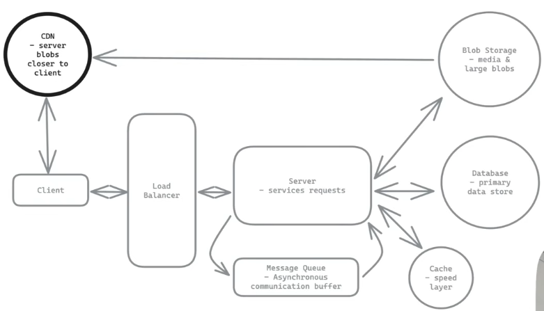

### [How to Prepare for System Design Interviews w/ Meta Staff Engineer - Hello Interview - SWE Interview Preparation](https://www.youtube.com/watch?v=Ru54dxzCyD0)

### Framework
1. **Requirements**
  - Functional: Features
  - Non-functional: Quality of the system, for example, low latency, scale to a specific number of users
2. **Core Entities**
  - Store, Database Tables
3. **API or Interface**
  - Rest/GraphQl Endpoints
4. **Data Flow**
5. **High-level Design**
6. **Deep Dives**
  - How to make sure low latency
  - How to make sure strong consistent
  - How to make sure scale

Primary Goal: Satisfy
- 1 and 6: Non-functional Requirements
- 2, 3, 4, 5: Functional Requirements

Evaluation:
1. Problem Solving: Identify & Prioritize the core challenges
2. Solution Design: Create scalable architectures with balanced trade-offs
3. Technical Excellence: Demonstrate deep knowledge and expertise
4. Communication: Clearly explain complex concepts to stakeholders

### Fundamentals
1. **Storage**
  - Relational Database: ACID => Atomicity - Consistency - Isolation - Durability
  - Document Database: Basically Available - Soft state - Eventually Consistent
  - Key - Value
2. **Scalability**
  - Scale Compute:
    - Vertical Scaling: Bigger Server
    - Horizontal Scaling: Load Balancer - Servers
  - Scale Storage
    - Sharding
    - Consistent Hashing
      - Redis, Cassandra, DynamoDB, Many CDNs
3. **Networking**
  - OSI Model (Layers)
    7. Application*
      - HTTP/HTTPS Protocols
      - REST vs GraphQL vs gRPC
      - RESTful Semantics
      - DNS Resolution
      - Websockets vs SSE (Server Send Event)
    6. Presentation
    5. Session
    4. Transport*
      - TCP
      - UDP
      - Request response lifecycle
    3. Network*
      - Load Balancing
      - Firewalls, ACLs (Access Control Lists)
    2. Data Link
    1. Physical
4. **Latency, Throughout & Performance**
  Processing time: RAM 100ns, SSD 0.1-0.2ms, HDD 1-2ms
  Response time:
    - A -- 1-10ms --> B Same Region
    - A -- ~50ms --> B Cross Region
5. **Fault Tolerance & Redundancy**
  - Failure modes (Replication strategies, Redundancy)
  - Failure Detection & Recovery
6. **CAP Theorem**
  - UserA -- write --> Data (USA Server)         -| x Replicate
  - UserB <-- read --> Data (Europe Server)      -|
  - Network fails between them
    a. STOP Serving data (Consistency)
    b. OR risk wrong data (Availability)
  - You can only have 2 out of 3:
    1. Consistency - All nodes/users see the same data at the same time
    2. Availability - Every request gets a response (successful or not)
    3. Partition tolerance - System works despite network failures between nodes
  - Examples Consistency
    - Ticket booking platform (Airline, Event, etc.)
      - If we sell a ticket, everyone needs to see it as unavailable, without delay
    - Inventory system (Amazon)
      - Can't sell the same last item to multiple customers
    - Financial systems
      - Stock trades must be executed in strict order
  - Examples Availability
    - Social media app
    - Yelp like business review service
    - Streaming service like Netflix
  - Strong consistency
    - Implement distributed transactions
    - Limit to a single node
    - Discuss consensus protocols
    - Accept higher latency
    - Example tools:
      - PostgreSQL
      - Traditional RDBMS
      - Spanner
      - NoSQL with strong consistency mode (DynamoDB)
  - Strong availability
    - Use multiple replicas
    - CDC (Change Data Capture) and eventual consistency is ok
    - Example tools
      - DynamoDB (in multi-AZ (Availability Zone) mode)
      - Cassandra
  - Different types of consistency
    1. Strong Consistency: all reads reflect most recent write
    2. Causal Consistency: related events appear in order
    3. Read-your-writes Consistency: user sees their own updates
    4. Eventual Consistency: updates will propagate eventually

### Components

1. CDN (Server blobs closer to client)
2. Load Balancer
3. Server (Services Requests)
4. Blob Storage (Media & Large blobs)
5. Database (Primary Data Store)
6. Case (Speed Layer)
7. Message Queue (Asynchronous comunication buffer)

### Problems
